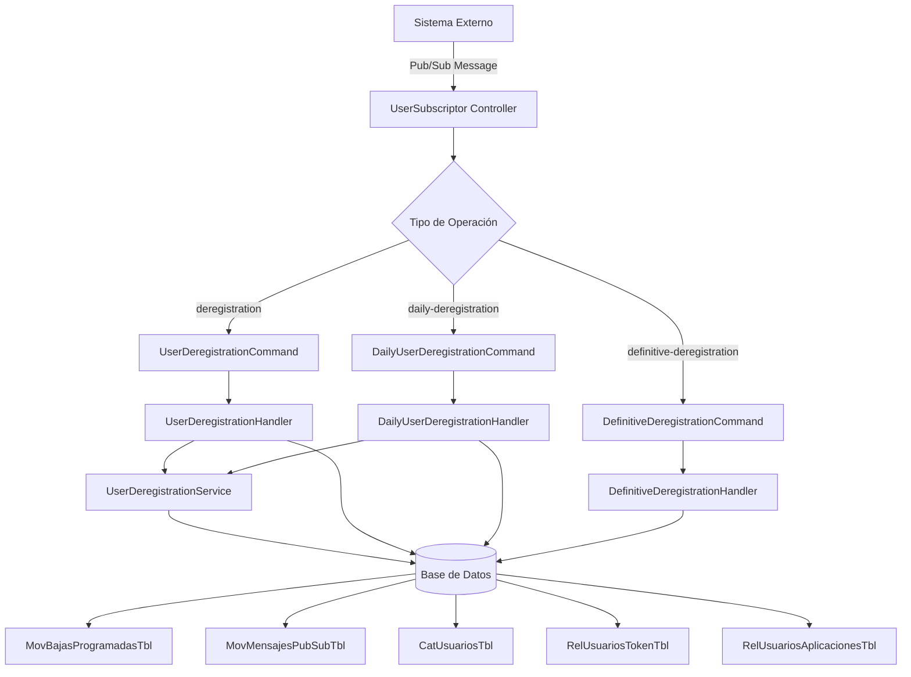
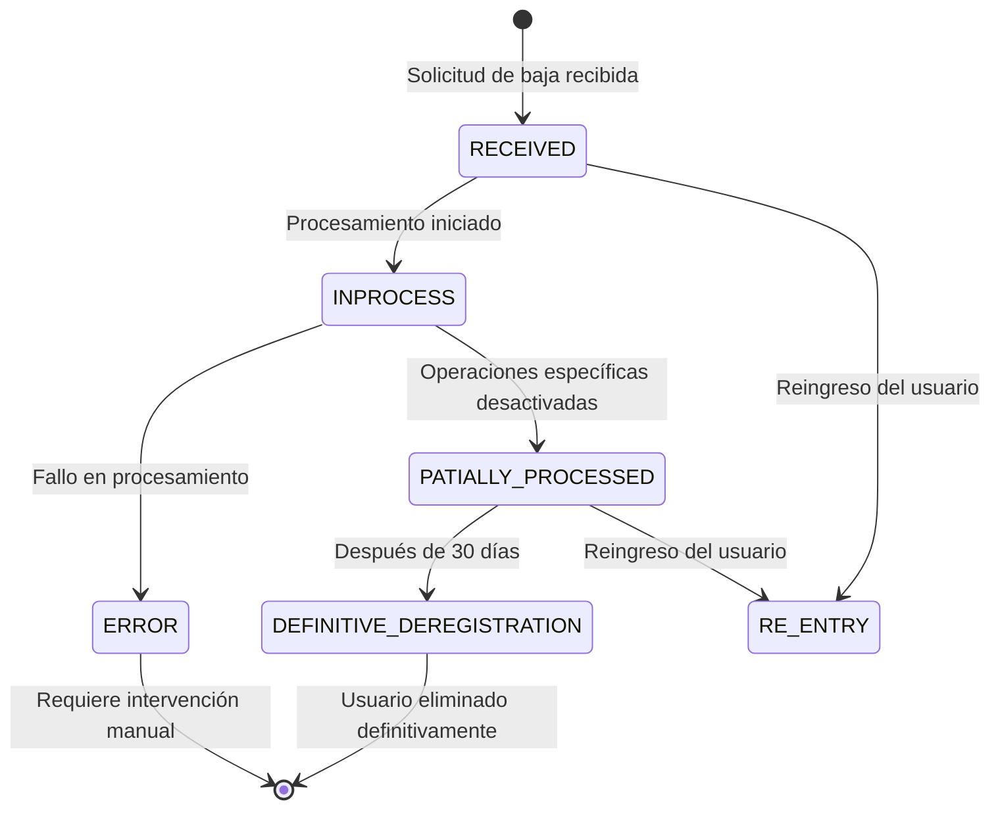
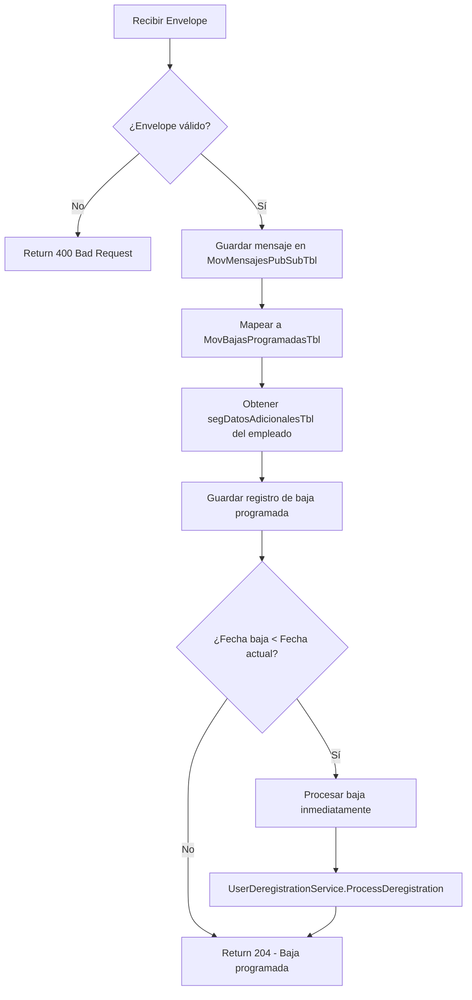
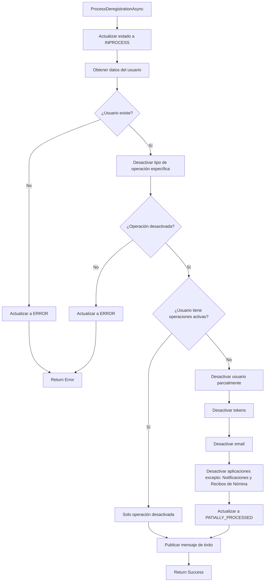
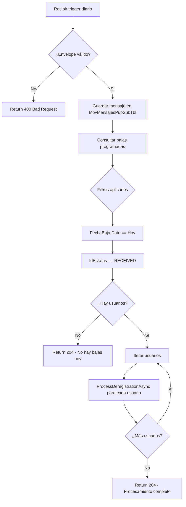
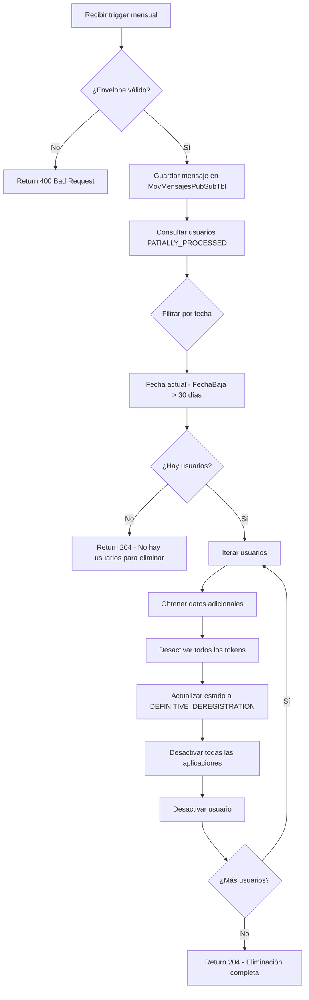
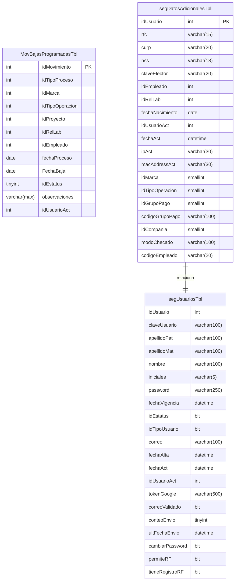
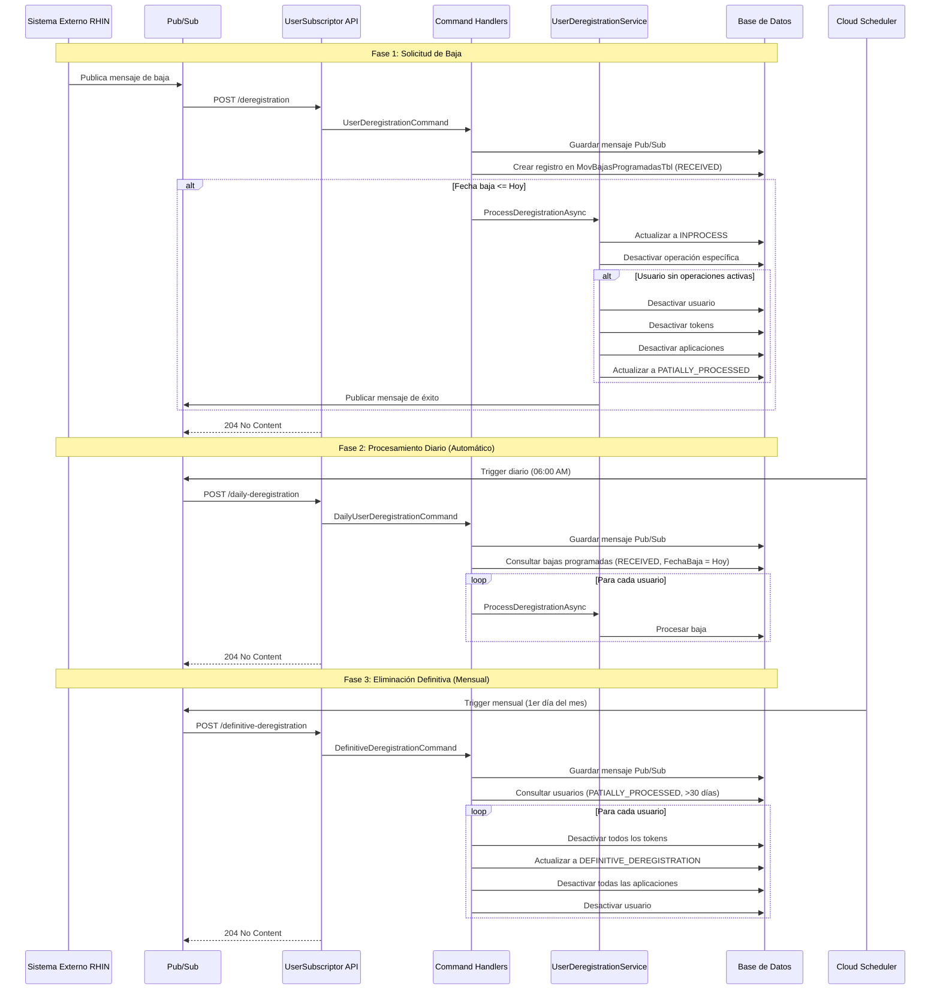

# PRD - Endpoints de Desregistro de Usuarios

## 1. Resumen Ejecutivo

### 1.1 Descripción General
Este documento describe los requisitos del producto para tres endpoints especializados del sistema de seguridad JWT que gestionan el proceso completo de baja de usuarios corporativos, desde el registro inicial de la baja hasta su eliminación definitiva del sistema.

### 1.2 Objetivos del Producto
- Automatizar el proceso de baja de usuarios en el sistema de seguridad corporativo
- Garantizar el procesamiento gradual y controlado de las bajas de usuarios
- Mantener trazabilidad completa de todo el proceso de desregistro
- Permitir la desactivación parcial de operaciones específicas antes de la baja total
- Procesar bajas programadas de manera automatizada mediante tareas diarias
- Eliminar definitivamente usuarios después de un período de retención de 30 días

### 1.3 Alcance
**En Alcance:**
- Endpoint de baja inicial (`/deregistration`)
- Endpoint de procesamiento diario (`/daily-deregistration`)
- Endpoint de baja definitiva (`/definitive-deregistration`)
- Integración con sistema Pub/Sub para mensajería asíncrona
- Gestión de estados del proceso de baja
- Desactivación parcial y total de usuarios

**Fuera de Alcance:**
- Interfaz de usuario para gestión manual
- Notificaciones por email a usuarios
- Reversión automática de bajas procesadas

---

## 2. Contexto del Negocio

### 2.1 Problema a Resolver
El sistema necesita gestionar el proceso completo de baja de usuarios corporativos de manera controlada, permitiendo:
- Bajas programadas con fecha futura
- Procesamiento parcial por tipo de operación y marca
- Retención temporal de datos antes de eliminación definitiva
- Procesamiento automatizado mediante tareas programadas

### 2.2 Usuarios y Stakeholders
- **Sistemas RHIN**: Envían notificaciones de baja mediante Pub/Sub
- **Administradores del sistema**: Supervisan el proceso de bajas
- **Departamento encargado de realizar las bajas**: Solicitan bajas de empleados

---

## 3. Especificaciones Técnicas

### 3.1 Arquitectura General



### 3.2 Estados del Proceso de Baja



**Estados disponibles:**
- `RECEIVED (1)`: Baja registrada, pendiente de procesar
- `INPROCESS (2)`: Baja en proceso de ejecución
- `PATIALLY_PROCESSED (3)`: Baja parcial completada (operaciones específicas desactivadas)
- `DEFINITIVE_DEREGISTRATION (4)`: Baja definitiva completada (después de 30 días)
- `ERROR (5)`: Error durante el procesamiento
- `RE_ENTRY (6)`: Usuario reingresado al sistema

---

## 4. Endpoints Detallados

### 4.1 POST /api/v1/UserSubscriptor/deregistration

#### 4.1.1 Descripción
Endpoint que recibe solicitudes de baja de usuarios desde sistemas externos mediante Pub/Sub. Registra la baja programada y la procesa inmediatamente si la fecha de baja es anterior a la fecha actual. Durante una baja parcial, se mantienen activas únicamente las siguientes aplicaciones:
- **Notificaciones**: Para mantener comunicación con el usuario
- **Recibos de Nómina**: Para acceso a información histórica de pagos

#### 4.1.2 Request

**Headers:**
```
Content-Type: application/json
```

**Body (Envelope de Pub/Sub):**
```json
{
  "message": {
    "messageId": "12345678-1234-1234-1234-123456789abc",
    "data": "base64_encoded_data",
    "publishTime": "2026-01-15T10:30:00Z",
    "attributes": {
      "seguridad":"baja"
    }
  },
  "subscription": "projects/my-project/subscriptions/seguridad-usuario-baja"
}
```

**Estructura del Data decodificado:**
```json
{
    "idEmpleado":242755,
    "idRelLab":551920,
    "fechaBaja":"2026-01-15",
    "fechaEnvio":"2026-01-15",
    "idUsuarioAct":141,
    "idCausaBaja":32,
    "accion":3
}
```

#### 4.1.3 Response

**Success (204 No Content)**
```
No body
```

**Error (400 Bad Request)**
```json
{
  "error": "Invalid Pub/Sub message format"
}
```

#### 4.1.4 Lógica de Negocio



#### 4.1.5 Proceso de Baja (UserDeregistrationService)



**Nota importante**: Durante la desactivación de aplicaciones, el sistema mantiene activas únicamente las aplicaciones de **Notificaciones** y **Recibos de Nómina**, permitiendo al usuario continuar recibiendo notificaciones y consultando su historial de pagos incluso después de la baja.

---

### 4.2 POST /api/v1/UserSubscriptor/daily-deregistration

#### 4.2.1 Descripción
Endpoint diseñado para ser invocado diariamente por un scheduler (Cloud Scheduler **seguridad-usuario-baja**). Procesa todas las bajas programadas cuya fecha de baja coincide con la fecha actual y que están en estado `RECEIVED`.

#### 4.2.2 Request

**Headers:**
```
Content-Type: application/json
```

**Body:**
```json
{
  "message": {
    "messageId": "12345678",
    "data": "",
    "publishTime": "2026-01-15T06:00:00Z",
    "attributes": {
      "baja-diaria": "ok"
    }
  },
  "subscription": "projects/my-project/subscriptions/seguridad-usuario-baja-diaria"
}
```

#### 4.2.3 Response

**Success (204 No Content)**
```
No body
```

**Error (400 Bad Request)**
```json
{
  "error": "Invalid Pub/Sub message format"
}
```

#### 4.2.4 Lógica de Negocio



#### 4.2.5 Casos de Uso
1. **Procesamiento automático diario**: Cloud Scheduler dispara este endpoint cada día a las 20 hrs
2. **Procesamiento batch**: Procesa múltiples usuarios en un solo ciclo
3. **Resiliencia**: Cada usuario se procesa individualmente, un error no afecta a los demás

---

### 4.3 POST /api/v1/UserSubscriptor/definitive-deregistration

#### 4.3.1 Descripción
Endpoint para eliminar definitivamente usuarios que llevan más de 30 días en estado `PATIALLY_PROCESSED`. Ejecuta la eliminación completa de tokens, relaciones con aplicaciones y desactivación definitiva del usuario.

#### 4.3.2 Request

**Headers:**
```
Content-Type: application/json
```

**Body:**
```json
{
  "message": {
    "messageId": "1234567890",
    "data": "",
    "publishTime": "2026-01-15T02:00:00Z",
    "attributes": {
      "baja-final": "ok"
    }
  },
  "subscription": "projects/my-project/subscriptions/seguridad-baja-definitiva"
}
```

#### 4.3.3 Response

**Success (204 No Content)**
```
No body
```

**Error (400 Bad Request)**
```json
{
  "error": "Invalid Pub/Sub message format"
}
```

#### 4.3.4 Lógica de Negocio



#### 4.3.5 Criterios de Eliminación
- Estado actual: `PATIALLY_PROCESSED (3)`
- Tiempo transcurrido: > 30 días desde `FechaBaja`
- Proceso irreversible: No existe reingreso después de este punto

---

## 5. Modelos de Datos

### 5.1 MovBajasProgramadasTbl



### 5.2 MovMensajesPubSubTbl

```csharp
{
    int IdMensaje PK,
    int IdTipoMensaje,
    string IdMensaje, // MessageId de Pub/Sub
    string DatosMensaje, // Data decodificado
    DateTime FechaPublicacion,
    string Subscripcion,
    string AtributosMensaje, // JSON serializado
    int IdUsuarioAct
}
```

### 5.3 Envelope (Value Object)

```csharp
public class Envelope
{
    public Message Message { get; set; }
    public string Subscription { get; set; }
}

public class Message
{
    public Dictionary<string, string>? Attributes { get; set; }
    public string MessageId { get; set; }
    public string Data { get; set; } // Base64 encoded
    public DateTime PublishTime { get; set; }
    
    public string EncodingData { get; } // Decoded data
    public T? To<T>() // Deserializa a tipo específico
}
```

---

## 6. Flujo Completo del Sistema



---

## 7. Casos de Uso

### 7.1 CU-01: Baja Inmediata de Usuario

**Actor Principal**: Sistema de RHIN  
**Precondiciones**: 
- Usuario existe en el sistema
- Fecha de baja es hoy o anterior

**Flujo Principal**:
1. Sistema externo envía solicitud de baja mediante Pub/Sub
2. Endpoint `/deregistration` recibe el mensaje
3. Sistema registra la baja en `MovBajasProgramadasTbl` con estado `RECEIVED`
4. Sistema detecta que fecha de baja <= fecha actual
5. Sistema procesa la baja inmediatamente
6. Sistema desactiva operación específica (marca + tipo de operación)
7. Si no hay más operaciones activas, desactiva usuario completamente
8. Sistema actualiza estado a `PATIALLY_PROCESSED`
9. Sistema envía confirmación a Pub/Sub

**Postcondiciones**:
- Usuario parcial o totalmente desactivado
- Baja registrada con estado `PATIALLY_PROCESSED`
- Aplicaciones desactivadas excepto Notificaciones y Recibos de Nómina
- Mensaje de confirmación publicado

---

### 7.2 CU-02: Baja Programada Futura

**Actor Principal**: Sistema de RHIN  
**Precondiciones**: 
- Usuario existe en el sistema
- Fecha de baja es futura

**Flujo Principal**:
1. Sistema externo envía solicitud de baja mediante Pub/Sub
2. Endpoint `/deregistration` recibe el mensaje
3. Sistema registra la baja en `MovBajasProgramadasTbl` con estado `RECEIVED`
4. Sistema detecta que fecha de baja > fecha actual
5. Sistema NO procesa la baja inmediatamente
6. Sistema programa la baja para procesamiento futuro
7. Sistema retorna éxito

**Postcondiciones**:
- Baja registrada con estado `RECEIVED`
- Usuario permanece activo hasta la fecha programada
- Baja será procesada por tarea diaria

---

### 7.3 CU-03: Procesamiento Diario Automático

**Actor Principal**: Cloud Scheduler  
**Precondiciones**: 
- Existen bajas programadas con fecha actual
- Bajas están en estado `RECEIVED`

**Flujo Principal**:
1. Cloud Scheduler dispara endpoint `/daily-deregistration` a las 20:00 Hrs
2. Sistema consulta todas las bajas con `FechaBaja = Hoy` y estado `RECEIVED`
3. Para cada usuario encontrado:
   - Procesa la baja mediante `UserDeregistrationService`
   - Desactiva operaciones específicas
   - Si corresponde, desactiva usuario completamente
   - Actualiza estado a `PATIALLY_PROCESSED`
4. Sistema retorna éxito

**Postcondiciones**:
- Todas las bajas del día procesadas
- Usuarios desactivados según corresponda
- Estados actualizados

---

### 7.4 CU-04: Eliminación Definitiva (30 días)

**Actor Principal**: Cloud Scheduler  
**Precondiciones**: 
- Existen usuarios en estado `PATIALLY_PROCESSED`
- Han transcurrido más de 30 días desde la fecha de baja

**Flujo Principal**:
1. Cloud Scheduler dispara endpoint `/definitive-deregistration` (mensual)
2. Sistema consulta usuarios con estado `PATIALLY_PROCESSED` y más de 30 días
3. Para cada usuario encontrado:
   - Desactiva todos los tokens del usuario
   - Actualiza estado a `DEFINITIVE_DEREGISTRATION`
   - Desactiva todas las relaciones con aplicaciones
   - Desactiva usuario definitivamente
4. Sistema retorna éxito

**Postcondiciones**:
- Usuarios eliminados definitivamente del sistema
- Estados actualizados a `DEFINITIVE_DEREGISTRATION`
- Proceso irreversible completado

---

### 7.5 CU-05: Error en Procesamiento

**Actor Principal**: Sistema  
**Precondiciones**: 
- Solicitud de baja recibida

**Flujo Principal**:
1. Sistema inicia procesamiento de baja
2. Ocurre un error:
   - Usuario no encontrado
   - Operación específica no existe
   - Error de base de datos
3. Sistema actualiza registro a estado `ERROR`
4. Sistema registra detalles del error en campo `Observaciones`
5. Sistema continúa con siguiente registro (si aplica)

**Postcondiciones**:
- Baja marcada con estado `ERROR`
- Detalles del error registrados
- Requiere intervención manual

---

## 8. Consideraciones de Seguridad

### 8.1 Validación de Datos
- Validar estructura del Envelope completo
- Validar decodificación de data Base64
- Validar existencia de campos requeridos
- Validar tipos de datos

### 8.2 Trazabilidad
- Todos los mensajes Pub/Sub se registran en `MovMensajesPubSubTbl`
- Estados del proceso registrados con timestamps
- Campo `Observaciones` para información adicional
- Auditoría completa del proceso de baja

### 8.3 Aplicaciones que Permanecen Activas

Durante el proceso de baja parcial, el sistema mantiene activas específicamente las siguientes aplicaciones:

| Aplicación | Razón de Permanencia |
|------------|----------------------|
| **Notificaciones** | Permite al usuario recibir comunicaciones importantes del sistema, incluyendo notificaciones sobre el estado de su baja y otros avisos relevantes |
| **Recibos de Nómina** | Garantiza el acceso continuo al historial de recibos de pago, cumpliendo con obligaciones legales de disponibilidad de información laboral |

**Implementación Técnica:**
- El parámetro global `APPS_TO_KEEP` (ID: 14) contiene los IDs de estas aplicaciones
- Durante el método `UpdateUserApplicationsAsync`, se consultan estos IDs desde `CatParametrosGralesTbl`
- Se desactivan todas las aplicaciones del usuario **excepto** las especificadas en este parámetro
- Esta configuración es flexible y puede modificarse ajustando el parámetro global sin cambios en el código

---

## 9. Configuración y Deployment

### 9.1 Cloud Scheduler Configuration

**Tarea Programada:**
```yaml
description: Tarea encargada de realizar las bajas programadas de los usuarios
name: projects/plowserve/locations/us-central1/jobs/seguridad-usuario-baja
pubsubTarget:
  attributes:
    baja-diaria: ok
    baja-final: ok
  topicName: projects/plowserve/topics/seg-usuario-alta
retryConfig:
  maxBackoffDuration: 3600s
  maxDoublings: 5
  maxRetryDuration: 0s
  minBackoffDuration: 5s
schedule: 0 20 * * 1-5
timeZone: America/Mexico_City
```
---
## 10. Testing

### 10.1 Casos de Prueba

#### Test Case 1: Baja inmediata exitosa
```
Given: Usuario existe con IdEmpleado = 12345
  And: Fecha baja = Hoy
  And: Usuario tiene solo una operación activa
  And: Usuario tiene 5 aplicaciones activas
When: POST /deregistration
Then: Response 204
  And: Estado = PATIALLY_PROCESSED
  And: Usuario desactivado
  And: Tokens desactivados
  And: Aplicaciones desactivadas = 3
  And: Aplicaciones activas = 2 (Notificaciones y Recibos de Nómina)
```

#### Test Case 2: Baja programada futura
```
Given: Usuario existe con IdEmpleado = 12345
  And: Fecha baja = +7 días
When: POST /deregistration
Then: Response 204
  And: Estado = RECEIVED
  And: Usuario permanece activo
```

#### Test Case 3: Procesamiento diario batch
```
Given: Existen 5 bajas programadas para hoy
  And: Todas en estado RECEIVED
When: POST /daily-deregistration
Then: Response 204
  And: Todas las bajas procesadas
  And: Todos los estados = PATIALLY_PROCESSED o ERROR
```

#### Test Case 4: Eliminación definitiva
```
Given: Usuario en estado PATIALLY_PROCESSED
  And: Fecha baja hace 35 días
When: POST /definitive-deregistration
Then: Response 204
  And: Estado = DEFINITIVE_DEREGISTRATION
  And: Todos los tokens desactivados
  And: Todas las aplicaciones desactivadas
```

#### Test Case 5: Error - Usuario no existe
```
Given: IdEmpleado = 99999 no existe
When: POST /deregistration
Then: Response 204 (procesado)
  And: Estado = ERROR
  And: Observaciones = "No se encontró la información del usuario."
```
---

## 11. Dependencias

### 11.1 Paquetes NuGet
- MediatR (para CQRS)
- AutoMapper (para mapeo de DTOs)
- Google.Cloud.PubSub.V1 (integración Pub/Sub)
- Microsoft.EntityFrameworkCore (acceso a datos)
- Newtonsoft.Json (serialización)

### 11.2 Servicios Externos
- Google Cloud Pub/Sub
- Google Cloud Scheduler
- Base de datos SQL Server

### 11.3 Repositorios Requeridos
- `IUserDeregistrationService`
- `IScheduledDeregistrationRepository`
- `IAdditionalDataRepository`
- `IRelUsuariosTokenRepository`
- `IUserRepository`
- `IApplicationRepository`
- `IPubSubRepository`
- `IUserOperationService`

---

## 12. Criterios de Aceptación

### 12.1 Funcionales
- ✅ Endpoint `/deregistration` registra y procesa bajas correctamente
- ✅ Endpoint `/daily-deregistration` procesa todas las bajas del día
- ✅ Endpoint `/definitive-deregistration` elimina usuarios después de 30 días
- ✅ Estados del proceso se actualizan correctamente
- ✅ Mensajes Pub/Sub se registran para auditoría
- ✅ Errores se manejan y registran apropiadamente
- ✅ Desactivación parcial funciona por operación específica
- ✅ Desactivación total funciona cuando no hay operaciones activas

### 12.2 No Funcionales
- ✅ Tiempo de respuesta < 5 segundos por usuario
- ✅ Procesamiento batch de hasta 1000 usuarios
- ✅ Tasa de error < 5%
- ✅ Disponibilidad 99.9%
- ✅ Logs completos de todas las operaciones

---

**Documento Versión**: 1.0  
**Fecha**: 15 de enero de 2026  
**Autor**: Equipo de Desarrollo - Seguridad Corporativa  
**Aprobado por**: [Engineering Manager]
