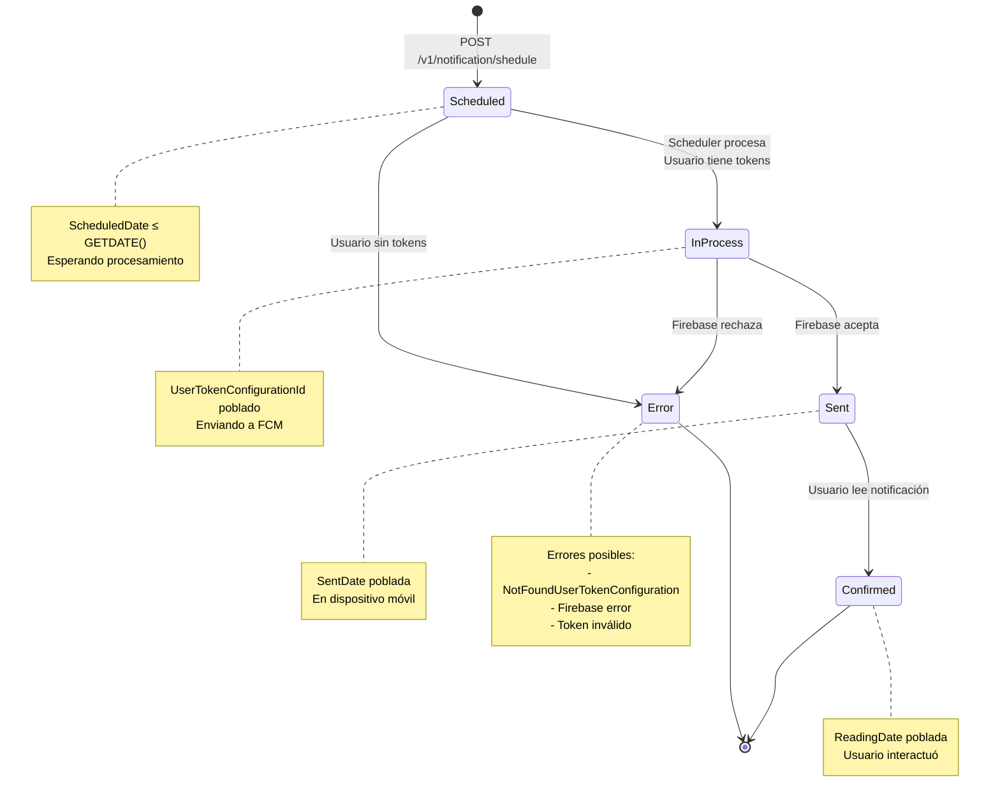

# API Notificaciones Push - Documentación Técnica

> **Audiencia:** Arquitectos, Desarrolladores y Equipo de Operaciones  
> **Versión:** 1.0  
> **Última actualización:** Diciembre 1, 2025

## 🎯 Resumen Ejecutivo

La API de Notificaciones Push es el **sistema final de envío** que recibe notificaciones programadas desde el Servicio Notificaciones y las envía a los dispositivos móviles a través de Firebase Cloud Messaging.

### Características Principales

- 📬 **Cola en SQL Server(snpti)** (`Notifications`)
- 🔄 **Procesamiento asíncrono** mediante Cloud Scheduler
- ⚡ **Event-driven architecture** con Domain Events
- ✅ **Validación de tokens** de dispositivos activos
- 📊 **Estados detallados** del ciclo de vida (5 estados)
- 🔥 **Integración con Firebase** Cloud Messaging
- 📱 **Confirmación de lectura** por parte del usuario

---

## 🏗️ Arquitectura y Flujo de Procesamiento

### Arquitectura General
El sistema utiliza una arquitectura de eventos y colas sobre SQL Server(snpti), orquestada por un Cloud Scheduler.

```mermaid
graph TB
    subgraph "ENTRADA"
        SRV[Servicio Notificaciones]
    end
    
    subgraph "API PUSH - Cloud Run"
        ENDPOINT[POST /v1/notification/shedule]
        DB[(SQL Server(snpti)<br/>Notifications)]
    end
    
    subgraph "PROCESAMIENTO ASÍNCRONO"
        CS[Cloud Scheduler<br/>Cada 2 min]
        PROCESS[GET /process-scheduled-notifications]
        EVENT[Domain Event<br/>SendingNotificationEvent]
    end
    
    subgraph "ENVÍO"
        FCM[Firebase Cloud Messaging]
        MOBILE[📱 AppSuite Mobile]
    end
    
    SRV -->|1. Programa| ENDPOINT
    ENDPOINT -->|2. Almacena en Cola| DB
    CS -->|3. Invoca Procesador| PROCESS
    PROCESS -->|4. Lee Cola| DB
    PROCESS -->|5. Dispara Evento| EVENT
    EVENT -->|6. Envía a Firebase| FCM
    FCM -.->|7. Notifica| MOBILE
    
    style DB fill:#c8e6c9
    style CS fill:#e3f2fd
    style FCM fill:#ffccbc
```

### Fases del Flujo
1.  **Recepción y Programación (`POST /v1/notification/shedule`):** El *Servicio Notificaciones* llama a este endpoint para registrar una notificación. El sistema la valida y la inserta en la tabla `Notifications` de SQL Server(snpti) con estado `Scheduled`.

2.  **Procesamiento de Cola (`GET /process-scheduled-notifications`):** Cada 2 minutos, el Cloud Scheduler invoca este endpoint. El servicio busca notificaciones `Scheduled` cuya fecha de programación ya pasó.

3.  **Validación y Envío (Event-Driven):**
    *   Para cada notificación, se buscan los tokens de dispositivo activos del usuario.
    *   Si no hay tokens, la notificación se marca como `Error`.
    *   Si hay tokens, se marca como `InProcess` y se dispara un evento de dominio (`SendingNotificationEvent`).
    *   Un `EventHandler` escucha este evento y realiza la llamada final a Firebase Cloud Messaging.
    *   Dependiendo de la respuesta de Firebase, el estado final se actualiza a `Sent` o `Error`.

---

---

## 📖 Runbook Operativo y de Mantenimiento

Este runbook centraliza todas las tareas de monitoreo, diagnóstico y mantenimiento del servicio.

### Infraestructura Clave

| Componente          | Nombre / Ubicación                               | Proyecto GCP | Entorno |
| ------------------- | ------------------------------------------------ | ------------ | ------- |
| **Servicio**        | `api-notificaciones-push`                        | `plowserve`    | PROD     |
| **Cloud Scheduler** | `suite-notifications-push`                   | `plowserve`    | PROD     |
| **Base de Datos**   | SQL Server(snpti)                                       | `plowserve`    | PROD     |
| **Tabla Principal** | `Notifications`                                  | -            | -       |
| **Logs**            | Cloud Run > `api-notificaciones-push` > Registros | `plowserve`    | PROD     |

---

### Diagnóstico General

#### 1. Verificar Estado del Servicio (Cloud Run)
- **Acción:** Ir a Cloud Run en el proyecto `plowserve`.
- **Verificar:** Que el servicio `api-notificaciones-push` esté en estado **verde (OK)**.
- **Métricas Clave:**
  - **Recuento de Solicitudes:** Debe mostrar tráfico constante en `/v1/notification/shedule` y `/process-scheduled-notifications`.
  - **Latencia:** Debe mantenerse baja (generalmente < 500ms).
  - **Errores 5XX:** El contador de errores del servidor debe ser cero o muy bajo.

#### 2. Verificar Estado del Job (Cloud Scheduler)
- **Acción:** Ir a Cloud Scheduler en el proyecto `plowserve`.
- **Verificar:** Que el job `dev-suite-notifications-push` tenga como "Resultado de la última ejecución" el valor "Éxito".

#### 3. Revisar Logs en Cloud Run
- **Acción:** En la pestaña "Registros" de Cloud Run, filtrar por `severity=(ERROR OR CRITICAL OR ALERT OR EMERGENCY)`.
- **Buscar Errores Comunes:**
  - `NotificationErrors.NotFoundUserTokenConfiguration`: **Error funcional**, no un fallo del sistema. Indica que un usuario no tiene tokens de dispositivo.
  - Errores de conexión a la base de datos (`Npgsql.NpgsqlException`).
  - Errores devueltos por Firebase (`ThirdParty-Fcm-Error`).
  - Timeouts o fallos en la ejecución del handler.

---

### Escenarios de Falla y Soluciones

#### Escenario 1: Notificaciones programadas pero no enviadas (Status `Scheduled`)

- **Síntoma:** Acumulación de notificaciones con `Status = 1`.
- **Diagnóstico:**
  ```sql
  -- Notificaciones encoladas por más de 10 minutos
  SELECT * FROM "Notifications" 
  WHERE "Status" = 1 AND "ScheduledDate" < GETDATE() - INTERVAL '10 minutes';
  ```
- **Causa Probable:** El Cloud Scheduler está pausado o el servicio de API Push está caído.
- **Solución:**
  1.  Verificar y reanudar el job `dev-suite-notifications-push` en Cloud Scheduler.
  2.  Verificar que el servicio `api-notificaciones-push` en Cloud Run esté activo.
  3.  Se puede forzar una ejecución manual desde Cloud Scheduler para procesar la cola acumulada.

#### Escenario 2: Notificaciones atascadas en procesamiento (Status `InProcess`)

- **Síntoma:** Acumulación de notificaciones con `Status = 2` por más de 5 minutos.
- **Diagnóstico:**
  ```sql
  -- Notificaciones en estado 'InProcess' por más de 5 minutos
  SELECT * FROM "Notifications" 
  WHERE "Status" = 2 AND "LastModified" < GETDATE() - INTERVAL '5 minutes';
  ```
- **Causa Probable:** El `EventHandler` que envía a Firebase falló o el servicio se reinició a mitad del proceso.
- **Solución (Reintento):**
  ```sql
  -- PRECAUCIÓN: Resetea el estado para que el scheduler lo vuelva a intentar.
  UPDATE "Notifications"
  SET "Status" = 1, "UserTokenConfigurationId" = NULL
  WHERE "Status" = 2 AND "LastModified" < GETDATE() - INTERVAL '5 minutes';
  ```

#### Escenario 3: Alta tasa de errores de envío (Status `Error`)

- **Síntoma:** Crecimiento rápido de notificaciones con `Status = 5`.
- **Diagnóstico:**
  ```sql
  -- Últimos 50 errores registrados
  SELECT "Id", "UserId", "Status", "LastModified", "ErrorMessage"
  FROM "Notifications" WHERE "Status" = 5
  ORDER BY "LastModified" DESC LIMIT 50;
  ```
- **Causa Probable:**
    1.  **Error Funcional (Común):** `NotFoundUserTokenConfiguration`. El usuario no tiene tokens. No requiere acción.
    2.  **Error de Tercero:** `ThirdParty-Fcm-Error`. Problema con Firebase (token inválido, cuota excedida). Revisar logs para más detalle.
- **Solución:** Si el error no es por falta de tokens, investigar la causa raíz (ej. configuración de Firebase). No se recomienda un reintento masivo a menos que la causa haya sido identificada y resuelta.

---

### Mantenimiento Periódico

#### Purga de Registros Antiguos
Para mantener el rendimiento de la base de datos, es necesario purgar periódicamente los registros antiguos.

- **Acción:** Ejecutar las siguientes consultas en SQL Server(snpti), preferiblemente durante horas de baja carga.
- **Frecuencia Recomendada:** Mensual.

```sql
-- Eliminar notificaciones enviadas o leídas con más de 3 meses de antigüedad
DELETE FROM "Notifications" 
WHERE "Status" IN (3, 4) AND "SentDate" < GETDATE() - INTERVAL '3 months';

-- Eliminar notificaciones con error de más de 1 mes de antigüedad
DELETE FROM "Notifications"
WHERE "Status" = 5 AND "ScheduledDate" < GETDATE() - INTERVAL '1 month';
```

---

## ⚙️ Endpoints de la API

### `POST /v1/notification/shedule`
- **Propósito:** Programa una nueva notificación en la cola.
- **Invocado por:** `servicionotificaciones`.

### `GET /process-scheduled-notifications`
- **Propósito:** Procesa la cola de notificaciones `Scheduled`.
- **Invocado por:** Cloud Scheduler `suite-notifications-push`.

---
_Fin del documento._

## ⚙️ Endpoints Adicionales

### Obtener Notificaciones por Usuario
Permite consultar el historial de notificaciones enviadas a un usuario específico.

- **Endpoint:** `GET /v1/notification/user/{userId}`
- **Uso:** Principalmente para diagnóstico y soporte.
- **Respuesta:**
  ```json
  [
    {
      "id": "d8f8b8a0-...",
      "title": "Préstamo dispersado",
      "description": "Tu préstamo ha sido dispersado.",
      "sentDate": "2025-12-01T10:30:05"
    }
  ]
  ```

---

### Diagrama de Estados



---

## ⚙️ Configuración del Cloud Scheduler

### Scheduler: `dev-suite-notifications-push`

| Parámetro | Valor |
|-----------|-------|
| **Nombre** | `dev-suite-notifications-push` |
| **Proyecto GCP** | `plowserve` |
| **Región** | `us-central1` |
| **Endpoint** | `GET https://[API-PUSH-URL]/process-scheduled-notifications` |
| **Schedule (cron)** | `*/2 * * * *` (cada 2 minutos, 24/7) |
| **Timeout** | Configurable |
| **Estado** | `ENABLED` |

### Comandos útiles (gcloud)

```bash
# Ver configuración actual
gcloud scheduler jobs describe dev-suite-notifications-push \
  --location=us-central1 \
  --project=plowserve

# Pausar el scheduler (mantenimiento)
gcloud scheduler jobs pause dev-suite-notifications-push \
  --location=us-central1 \
  --project=plowserve

# Reanudar el scheduler
gcloud scheduler jobs resume dev-suite-notifications-push \
  --location=us-central1 \
  --project=plowserve

# Ejecutar manualmente (testing)
gcloud scheduler jobs run dev-suite-notifications-push \
  --location=us-central1 \
  --project=plowserve

# Ver últimas ejecuciones
gcloud logging read "resource.type=cloud_scheduler_job AND resource.labels.job_id=dev-suite-notifications-push" \
  --limit=10 \
  --project=plowserve

# Ver logs de la API Push
gcloud logging read "resource.type=cloud_run_revision AND resource.labels.service_name=api-notificaciones-push" \
  --limit=50 \
  --project=plowserve
```

---

## 🚨 Runbook Operativo

### Escenario 1: Notificaciones Programadas pero No Enviadas

**Síntoma:** Notificaciones con `Status = 1` (Scheduled) acumulándose en SQL Server(snpti)

**Diagnóstico:**

```sql
-- Verificar notificaciones programadas pendientes
SELECT 
    COUNT(*) AS TotalScheduled,
    MIN("ScheduledDate") AS MasAntigua,
    MAX("ScheduledDate") AS MasReciente
FROM "Notifications"
WHERE "Status" = 1
  AND "ScheduledDate" <= GETDATE();
```

**Causas posibles:**

1. **Scheduler pausado o deshabilitado**
   ```bash
   gcloud scheduler jobs describe dev-suite-notifications-push \
     --location=us-central1 --project=plowserve | grep state
   ```

2. **API Push caída**
   ```bash
   gcloud run services describe api-notificaciones-push \
     --region=us-central1 --project=plowserve
   ```

**Solución:**

```bash
# Reanudar scheduler si está pausado
gcloud scheduler jobs resume dev-suite-notifications-push \
  --location=us-central1 --project=plowserve

# Ejecutar manualmente
gcloud scheduler jobs run dev-suite-notifications-push \
  --location=us-central1 --project=plowserve

# Llamar directamente al endpoint
curl -X GET "https://[API-PUSH-URL]/process-scheduled-notifications"
```

---

### Escenario 2: Alta Tasa de Errores (Status = 5)

**Síntoma:** Muchas notificaciones con `Status = 5` (Error)

**Diagnóstico:**

```sql
-- Ver distribución de errores
SELECT 
    COUNT(*) AS TotalErrores,
    MIN("ScheduledDate") AS PrimerError,
    MAX("ScheduledDate") AS UltimoError
FROM "Notifications"
WHERE "Status" = 5
  AND "ScheduledDate" >= GETDATE() - INTERVAL '24 hours';

-- Notificaciones por estado
SELECT 
    "Status",
    COUNT(*) AS Total
FROM "Notifications"
WHERE "ScheduledDate" >= GETDATE() - INTERVAL '24 hours'
GROUP BY "Status"
ORDER BY "Status";
```

**Causas comunes:**

1. **Usuarios sin tokens activos** (Error más común)
   - Usuario no tiene la app instalada
   - Usuario desinstaló la app
   - Token expirado
   - **Solución:** Usuario debe abrir AppSuite para registrar nuevo token

2. **Firebase rechaza envío**
   - Token inválido en Firebase
   - App no configurada correctamente
   - Cuota de Firebase excedida
   - **Solución:** Revisar configuración de Firebase, verificar cuotas

3. **Problemas de conectividad con Firebase**
   - Timeout al llamar a FCM
   - **Solución:** Verificar estado de Firebase: https://status.firebase.google.com/

**Reintento manual (solo si se resolvió el problema):**

```sql
-- PRECAUCIÓN: Solo ejecutar si se resolvió el problema raíz
UPDATE "Notifications"
SET "Status" = 1  -- Volver a Scheduled
WHERE "Status" = 5
  AND "ScheduledDate" >= GETDATE() - INTERVAL '1 hour'
  -- Excluir errores de usuarios sin tokens (no se puede resolver automáticamente)
  AND NOT EXISTS (
    SELECT 1 FROM "DomainEvents" 
    WHERE "EntityId" = "Notifications"."Id" 
    AND "EventType" LIKE '%NotFoundUserTokenConfiguration%'
  );
```

---

### Escenario 3: Notificaciones Atascadas en InProcess

**Síntoma:** Notificaciones con `Status = 2` (InProcess) por más de 5 minutos

**Diagnóstico:**

```sql
SELECT 
    "Id",
    "UserId",
    "ScheduledDate",
    GETDATE() - "ScheduledDate" AS TiempoEnProceso
FROM "Notifications"
WHERE "Status" = 2
  AND "ScheduledDate" < GETDATE() - INTERVAL '5 minutes'
ORDER BY "ScheduledDate";
```

**Causa:** El event handler falló o se reinició el servicio mientras procesaba

**Solución:**

```sql
-- Reset a estado Scheduled para reintento
UPDATE "Notifications"
SET "Status" = 1,
    "UserTokenConfigurationId" = NULL
WHERE "Status" = 2
  AND "ScheduledDate" < GETDATE() - INTERVAL '5 minutes';
```

---

## 📦 Especificaciones Técnicas

### Stack Tecnológico

| Componente | Tecnología |
|------------|------------|
| **Framework** | .NET |
| **Arquitectura** | Clean Architecture + CQRS |
| **Patrón** | Mediator (MediatR) |
| **Base de Datos** | SQL Server(snpti) |
| **ORM** | Entity Framework Core |
| **Events** | Domain Events |
| **Cloud** | Google Cloud Platform |
| **Compute** | Cloud Run |
| **Scheduler** | Cloud Scheduler |
| **Push Service** | Firebase Cloud Messaging |

---

**Documentación generada:** Diciembre 1, 2025  
**Versión:** 1.0  
**Autor:** Edgar R. Rodriguez
