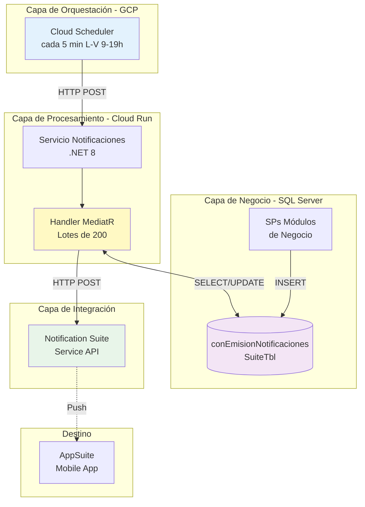
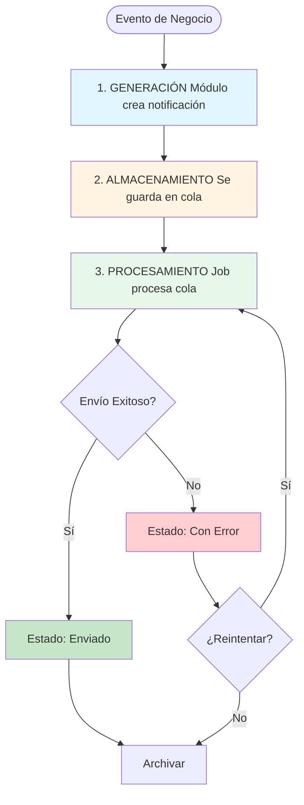
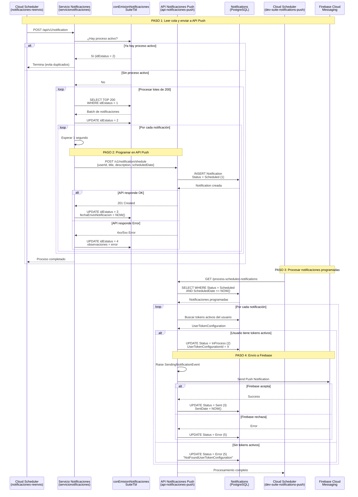
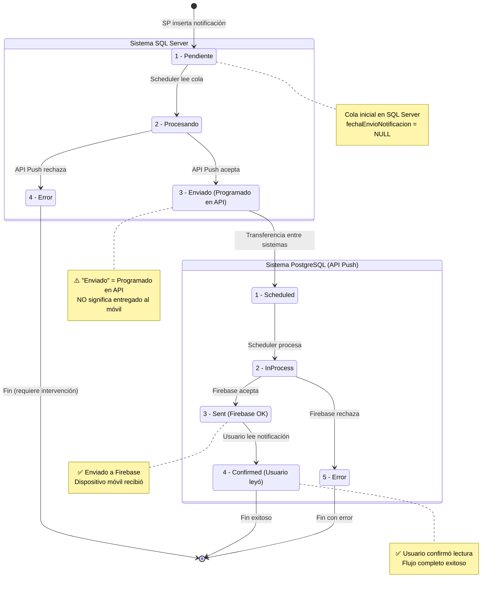
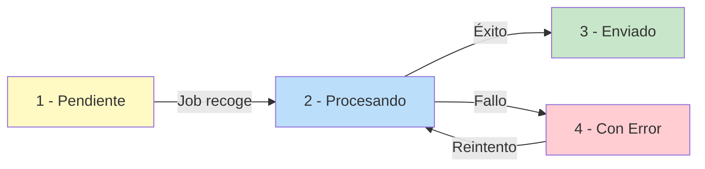
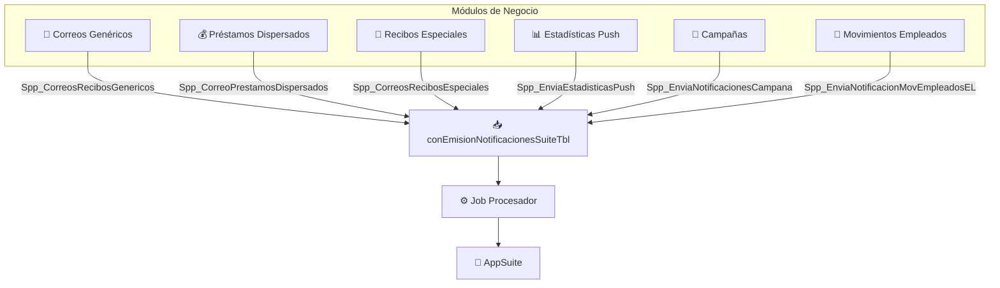
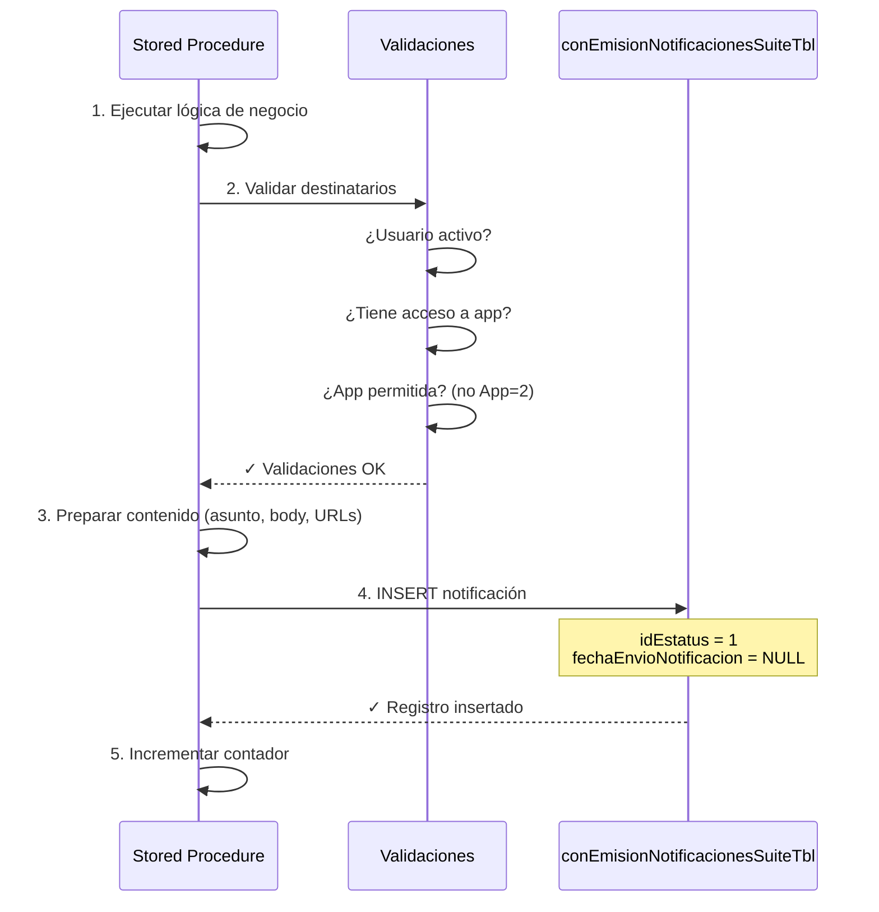
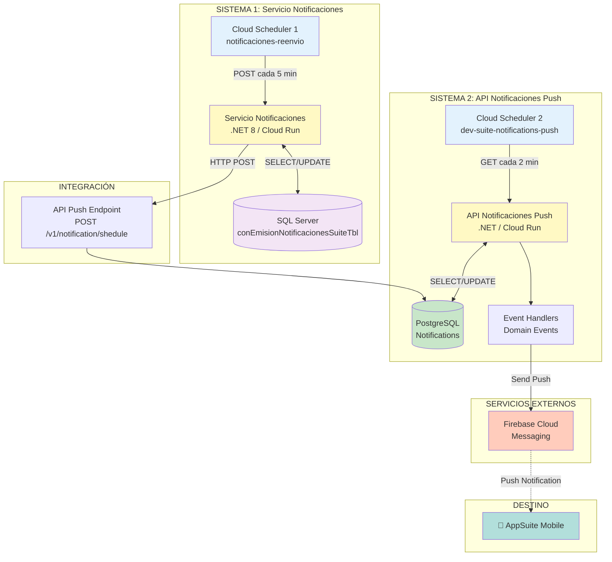

# Sistema de Notificaciones AppSuite - Documentación Técnica

> **Audiencia:** Arquitectos, Desarrolladores y Equipo de Operaciones  
> **Versión:** 1.0  
> **Última actualización:** Diciembre 1, 2025

## 🎯 Resumen Ejecutivo

El sistema de notificaciones AppSuite es una **arquitectura asíncrona basada en colas** para el envío de notificaciones push desde múltiples módulos de negocio hacia la aplicación móvil AppSuite.

### Características Principales

- 📬 **Cola centralizada** en SQL Server (`conEmisionNotificacionesSuiteTbl`)
- 🔄 **Procesamiento asíncrono** mediante Cloud Scheduler + Cloud Run
- ⚡ **Procesamiento por lotes** de hasta 200 notificaciones con rate limiting
- ✅ **Trazabilidad completa** del ciclo de vida (4 estados)
- 🔁 **Reintento manual** de notificaciones fallidas
- 📊 **Auditoría y monitoreo** con timestamps y mensajes de error
- 🛡️ **Prevención de duplicados** mediante validación de procesos activos

### Arquitectura de Alto Nivel



## 🏛️ Decisiones Arquitectónicas

### ¿Por qué una cola en SQL Server y no mensajería (Pub/Sub, RabbitMQ, etc.)?

| Aspecto | Decisión | Justificación |
|---------|----------|---------------|
| **Persistencia** | SQL Server | Los datos de negocio ya están en SQL Server. Evita duplicación de datos y mantiene consistencia transaccional. |
| **Simplicidad** | Sin broker adicional | No requiere infraestructura adicional, reduce puntos de falla y costos operativos. |
| **Auditoría** | Tabla relacional | Consultas SQL estándar para reportes y análisis. Trazabilidad nativa con timestamps. |
| **Reintentos** | Control manual | Permite análisis de errores antes de reintentar. Evita loops infinitos. |
| **Transaccionalidad** | ACID en SQL | Los SPs insertan notificaciones en la misma transacción que la lógica de negocio. |

### ¿Por qué procesamiento asíncrono?

**Problema resuelto:** Si los SPs intentaran enviar notificaciones síncronamente:
- ❌ Timeouts en SPs si el servicio de notificaciones está lento/caído
- ❌ Bloqueo de procesos de negocio (dispersión de préstamos, nóminas, etc.)
- ❌ Sin capacidad de reintentos automáticos
- ❌ Difícil implementar rate limiting

**Solución implementada:**
- ✅ SPs solo insertan en tabla (operación rápida <10ms)
- ✅ Cloud Scheduler procesa la cola independientemente
- ✅ Fallos no impactan procesos de negocio
- ✅ Rate limiting de 1 seg entre envíos
- ✅ Procesamiento en lotes optimizado

### ¿Por qué Cloud Scheduler y no un servicio Windows/daemon?

| Criterio | Cloud Scheduler | Servicio Windows |
|----------|-----------------|------------------|
| **Disponibilidad** | 99.95% SLA de GCP | Depende de servidor on-premise |
| **Escalabilidad** | Cloud Run escala automáticamente | Escalado manual |
| **Mantenimiento** | Gestionado por Google | Requiere parchado, actualizaciones |
| **Monitoreo** | Cloud Logging/Monitoring integrado | Requiere configuración custom |
| **Costos** | Pay-per-use | Servidor 24/7 |

**Decisión:** Cloud Scheduler invoca Cloud Run para aprovechar serverless y reducir operaciones.

### Limitaciones Conocidas

| Limitación | Impacto | Mitigación |
|------------|---------|------------|
| **Sin reintentos automáticos** | Notificaciones fallidas requieren intervención manual | Script SQL documentado para reintentos. Considerar implementar en roadmap. |
| **Delay de hasta 5 minutos** | Notificaciones no son en tiempo real | Aceptable para el caso de uso actual (recibos, campañas). |
| **Rate limiting de 1 seg** | Throughput máximo ~3,600 notif/hora | Suficiente para volumen actual. Monitorear crecimiento. |
| **Lotes de 200** | Procesos grandes pueden requerir múltiples ejecuciones | Cloud Run tiene timeout de 3 min. Lotes de 200 completan en ~200 seg. |
| **Solo horario laboral** | No procesa fuera de L-V 9-19h | Si se requiere 24/7, actualizar cron del scheduler. |

## 🏗️ Cómo Funciona el Sistema

### Visión General del Flujo

El sistema funciona en 3 fases principales:

/! Al diagrama le falta.


### Fase 1: Generación de Notificaciones

Cuando ocurre el procesamiento de las notificaciones de conProcesosTbl de tipo push(ej: dispersión de préstamos, generación de recibos, campañas), los procedimientos almacenados de los motivos de correo del módulo correspondiente **registran** la notificación en la tabla central(conEmisionNotificacionesTbl).

**¿Qué sucede?**
1. El SP valida que el usuario destinatario esté activo
2. Verifica que el usuario tenga acceso a la aplicación
3. Prepara el contenido (asunto, cuerpo, URLs)
4. Inserta un registro en `conEmisionNotificacionesSuiteTbl` con estado **Pendiente**

### Fase 2: Almacenamiento en Cola

La tabla `conEmisionNotificacionesSuiteTbl` actúa como una **cola persistente** que almacena:

| Dato | Propósito |
|------|-----------|
| **idSession** | Agrupa notificaciones del mismo proceso/lote |
| **idUsuarioDestinatario** | Identifica a quién va dirigida |
| **asunto + body** | Contenido de la notificación |
| **urlArchivos** | Enlaces a documentos adjuntos |
| **idEstatus** | Estado actual (1=Pendiente, 2=Procesando, 3=Enviado, 4=Error) |
| **fechaEnvioNotificacion** | Timestamp de cuándo se envió (NULL si está pendiente) |

### Fase 3: Procesamiento y Programación

Un **Cloud Scheduler** (`notificaciones-reenvio-notificaciones` en proyecto `plowserve`) invoca periódicamente el endpoint de procesamiento:

**Endpoint de Procesamiento:**
```
POST https://servicionotificaciones-355837773731.us-central1.run.app/api/v1/notification
```

**Flujo de procesamiento completo (4 pasos):**



### Explicación Detallada de Cada Paso

#### **PASO 1: Lectura de Cola** (`servicionotificaciones`)
- **Scheduler:** `notificaciones-reenvio-notificaciones` (proyecto `plowserve`)
- **Endpoint:** `POST https://servicionotificaciones-355837773731.us-central1.run.app/api/v1/notification`
- **Frecuencia:** Cada 5 minutos (L-V 9AM-7PM)
- **Función:** Lee la cola `conEmisionNotificacionesSuiteTbl` de SQL Server
- **Protecciones:**
  - Validación de proceso activo (previene duplicados)
  - Procesamiento en lotes de 200
  - Rate limiting de 1 segundo entre envíos

#### **PASO 2: Programación en API Push** (`api-notificaciones-push`)
- **Endpoint destino:** `POST /v1/notification/shedule`
- **Base de datos:** PostgreSQL (tabla `Notifications`)
- **Función:** Registra cada notificación con estado `Scheduled` (1) para procesamiento posterior
- **Datos transferidos:**
  - `ApplicationIdDestination`: ID de AppSuite
  - `ApplicationIdOrigin`: ID del módulo origen
  - `UserId`: Usuario destinatario
  - `Title`: Asunto de la notificación
  - `Description`: Cuerpo del mensaje
  - `ScheduledDate`: Timestamp de programación (NOW)
  - `Data`: Metadata adicional (RedirectMode, etc.)

#### **PASO 3: Procesamiento de Notificaciones Programadas** (`api-notificaciones-push`)
- **Scheduler:** `dev-suite-notifications-push` (proyecto `ci-test`)
- **Endpoint:** `GET /process-scheduled-notifications`
- **Frecuencia:** Configurable (típicamente cada 1-5 minutos)
- **Función:** 
  - Busca notificaciones con estado `Scheduled` (1) cuya fecha programada ya pasó
  - Valida tokens activos del usuario en la aplicación destino
  - Cambia estado a `InProcess` (2)
  - Dispara evento de dominio `SendingNotificationEvent`

#### **PASO 4: Envío a Firebase Cloud Messaging**
- **Servicio:** Firebase Cloud Messaging (FCM)
- **Trigger:** Event Handler de `SendingNotificationEvent`
- **Función:** Envío real de la notificación push al dispositivo móvil
- **Estados finales:**
  - `Sent` (3): Notificación enviada exitosamente + `SentDate` poblada
  - `Error` (5): Fallo en el envío (Firebase caído, token inválido, etc.)
  - `Confirmed` (4): Usuario leyó la notificación (actualización posterior)

### Mapeo de Estados entre Sistemas

| Sistema | Base de Datos | Estados | Tabla |
|---------|---------------|---------|-------|
| **Servicio Notificaciones** | SQL Server | 1=Pendiente, 2=Procesando, 3=Enviado, 4=Error | `conEmisionNotificacionesSuiteTbl` |
| **API Notificaciones Push** | PostgreSQL | 1=Scheduled, 2=InProcess, 3=Sent, 4=Confirmed, 5=Error | `Notifications` |

⚠️ **IMPORTANTE:** El estado "Enviado" (3) en `conEmisionNotificacionesSuiteTbl` significa que se **programó exitosamente** en la API Push, NO que llegó al dispositivo móvil. El envío real a Firebase ocurre en el PASO 4.

### Características Clave del Procesamiento

| Característica | Descripción | Beneficio |
|----------------|-------------|-----------|
| **Doble cola asíncrona** | Cola en SQL Server + Cola en PostgreSQL | Desacoplamiento completo entre módulos de negocio y sistema de notificaciones |
| **Protección concurrencia** | Validación de procesos activos en ambos schedulers | Previene envíos duplicados |
| **Rate limiting** | 1 segundo entre llamadas API | Evita saturación del servicio |
| **Validación de tokens** | Verifica tokens activos antes de enviar | Reduce errores de envío a dispositivos no registrados |
| **Trazabilidad completa** | Timestamps en cada etapa | Auditoría end-to-end del flujo |
| **Event-driven** | Domain Events para envío a Firebase | Separación de responsabilidades, extensible |
| **Manejo de errores** | Estados de error en ambos sistemas | Identificación rápida de problemas |

## 🔄 Ciclo de Vida Completo de una Notificación

### Vista Unificada (Ambos Sistemas)



### Estados por Sistema

#### **Sistema 1: Servicio Notificaciones (SQL Server)**

| Estado | Valor | Significado | Campo Clave |
|--------|-------|-------------|-------------|
| **Pendiente** | 1 | Esperando procesamiento | `fechaEnvioNotificacion` = NULL |
| **Procesando** | 2 | Enviando a API Push | `fechaAct` actualizado |
| **Enviado** | 3 | **Programado en API Push exitosamente** | `fechaEnvioNotificacion` poblada |
| **Error** | 4 | Fallo al programar en API Push | `observaciones` con mensaje error |

#### **Sistema 2: API Notificaciones Push (PostgreSQL)**

| Estado | Valor | Significado | Campo Clave |
|--------|-------|-------------|-------------|
| **Scheduled** | 1 | Programada, esperando procesamiento | `ScheduledDate` ≤ NOW |
| **InProcess** | 2 | Enviando a Firebase | `UserTokenConfigurationId` poblado |
| **Sent** | 3 | **Enviada a Firebase exitosamente** | `SentDate` poblada |
| **Confirmed** | 4 | Usuario confirmó lectura | `ReadingDate` poblada |
| **Error** | 5 | Fallo en envío a Firebase o validación | Domain Events registrados |

## 📋 Tabla Central: `conEmisionNotificacionesSuiteTbl`


Esta tabla es el **corazón del sistema**. Almacena todas las notificaciones en cola.

#### Estructura y Significado de Campos

```sql
CREATE TABLE dbo.conEmisionNotificacionesSuiteTbl
(
    -- Identificación
    idEmision                   BIGINT IDENTITY(1,1) NOT NULL,  -- ID único de la notificación
    idSession                   VARCHAR(30) NOT NULL,           -- Agrupa notificaciones del mismo proceso
    
    -- Clasificación
    idAplicacion                SMALLINT NOT NULL,              -- Módulo origen (34=Campañas, etc.)
    idMotivoCorreo              SMALLINT NOT NULL,              -- Tipo de notificación
    
    -- Destinatario
    idUsuarioDestinatario       INTEGER NOT NULL,               -- Usuario que recibirá la notificación
    
    -- Contenido
    asunto                      VARCHAR(1000) NOT NULL,         -- Título de la notificación
    body                        VARCHAR(8000) NOT NULL,         -- Cuerpo del mensaje (puede incluir HTML)
    urlArchivos                 VARCHAR(2000) NULL,             -- Links a documentos/archivos adjuntos
    
    -- Control y Auditoría
    observaciones               VARCHAR(500) NULL,              -- Notas adicionales o mensajes de error
    fechaEnvioNotificacion      DATETIME NULL,                  -- Cuándo se envió (NULL = no enviada aún)
    idEstatus                   TINYINT NOT NULL DEFAULT 1,     -- 1=Pendiente, 2=Procesando, 3=Enviado, 4=Error
    idUsuarioAct                INTEGER NOT NULL,               -- Quién creó el registro
    fechaAct                    DATETIME NOT NULL DEFAULT GETDATE(), -- Cuándo se creó
    
    CONSTRAINT PK_conEmisionNotificacionesSuiteTbl PRIMARY KEY (idEmision)
)
```

#### Índices para Rendimiento

Los índices están diseñados para las consultas más frecuentes:

| Índice | Columna | ¿Para qué se usa? |
|--------|---------|-------------------|
| **IX_idSession** | idSession | Consultar todas las notificaciones de un proceso específico |
| **IX_idUsuarioDestinatario** | idUsuarioDestinatario | Ver notificaciones de un usuario |
| **IX_idEstatus** | idEstatus | **CRÍTICO**: El job busca notificaciones pendientes `WHERE idEstatus = 1` |
| **IX_fechaAct** | fechaAct | Ordenar notificaciones por antigüedad, limpieza de datos antiguos |

### Catálogo de Estados



| Estado | Valor | Significado | ¿Cuándo se usa? |
|--------|-------|-------------|-----------------|
| **Pendiente** | 1 | Notificación registrada, esperando procesamiento | Estado por defecto al insertar |
| **Procesando** | 2 | El job está intentando enviarla | Mientras el servicio de notificaciones trabaja |
| **Enviado** | 3 | Envío exitoso, `fechaEnvioNotificacion` poblada | Cuando el servicio confirma recepción |
| **Con Error** | 4 | Fallo en el envío, revisar `observaciones` | Si el servicio retorna error o timeout |

## 🔌 Integración: ¿Cómo se Generan las Notificaciones?

### Módulos que Generan Notificaciones

Cada módulo de negocio tiene su propio procedimiento almacenado que, en cierto punto de su ejecución, **inserta** notificaciones en la cola:



### Patrón de Integración Estándar

**Todos los procedimientos siguen el mismo patrón** de 5 pasos:


**Todos los procedimientos siguen el mismo patrón** de 5 pasos:



## ⚙️ Procesamiento: Detalles de Implementación

El procesamiento de notificaciones se realiza en **dos etapas** con dos servicios independientes orquestados por Cloud Schedulers.

### Configuración de Cloud Schedulers

#### **Scheduler 1: Lectura de Cola SQL** (`notificaciones-reenvio-notificaciones`)

| Parámetro | Valor | Descripción |
|-----------|-------|-------------|
| **Nombre** | `notificaciones-reenvio-notificaciones` | Identificador del job |
| **Proyecto GCP** | `plowserve` | Proyecto de producción |
| **Región** | `us-central1` | Central US (Iowa) |
| **Endpoint** | `POST https://servicionotificaciones-355837773731.us-central1.run.app/api/v1/notification` | URL del servicio notificaciones |
| **Schedule (cron)** | `*/5 9-19 * * 1-5` | Cada 5 min, L-V 9AM-7PM (GMT-6 México) |
| **Timeout** | `180 segundos` | Máximo 3 minutos por ejecución |
| **Retry Config** | `max-retry-duration: 0s` | Sin reintentos automáticos |
| **Estado** | `ENABLED` | Activo en producción |
| **Base de Datos** | SQL Server | `conEmisionNotificacionesSuiteTbl` |
| **Función** | Lee cola SQL y programa en API Push | PASO 1 y 2 del flujo |

**Comandos útiles (gcloud):**

```bash
# Ver configuración actual
gcloud scheduler jobs describe notificaciones-reenvio-notificaciones \
  --location=us-central1 \
  --project=plowserve

# Pausar el scheduler (mantenimiento)
gcloud scheduler jobs pause notificaciones-reenvio-notificaciones \
  --location=us-central1 \
  --project=plowserve

# Reanudar el scheduler
gcloud scheduler jobs resume notificaciones-reenvio-notificaciones \
  --location=us-central1 \
  --project=plowserve

# Ejecutar manualmente (testing)
gcloud scheduler jobs run notificaciones-reenvio-notificaciones \
  --location=us-central1 \
  --project=plowserve

# Ver últimas ejecuciones
gcloud logging read "resource.type=cloud_scheduler_job AND resource.labels.job_id=notificaciones-reenvio-notificaciones" \
  --limit=10 \
  --project=plowserve
```

---

#### **Scheduler 2: Procesamiento Push** (`dev-suite-notifications-push`)

| Parámetro | Valor | Descripción |
|-----------|-------|-------------|
| **Nombre** | `dev-suite-notifications-push` | Identificador del job |
| **Proyecto GCP** | `ci-test` | Proyecto de desarrollo/testing |
| **Región** | `us-central1` | Central US (Iowa) |
| **Endpoint** | `GET https://[API-PUSH-URL]/process-scheduled-notifications` | URL de API notificaciones push |
| **Schedule (cron)** | Configurable (ej: `*/2 * * * *`) | Cada 2 minutos (24/7) |
| **Timeout** | Configurable | Depende del volumen |
| **Estado** | `ENABLED` | Activo |
| **Base de Datos** | PostgreSQL | Tabla `Notifications` |
| **Función** | Procesa cola PostgreSQL y envía a Firebase | PASO 3 y 4 del flujo |

**Comandos útiles (gcloud):**

```bash
# Ver configuración actual
gcloud scheduler jobs describe dev-suite-notifications-push \
  --location=us-central1 \
  --project=ci-test

# Pausar el scheduler (mantenimiento)
gcloud scheduler jobs pause dev-suite-notifications-push \
  --location=us-central1 \
  --project=ci-test

# Reanudar el scheduler
gcloud scheduler jobs resume dev-suite-notifications-push \
  --location=us-central1 \
  --project=ci-test

# Ejecutar manualmente (testing)
gcloud scheduler jobs run dev-suite-notifications-push \
  --location=us-central1 \
  --project=ci-test

# Ver últimas ejecuciones
gcloud logging read "resource.type=cloud_scheduler_job AND resource.labels.job_id=dev-suite-notifications-push" \
  --limit=10 \
  --project=ci-test
```

---

### Cálculo de Capacidad del Sistema Completo

**Scheduler 1 (SQL → API Push):**
- Ejecución cada 5 minutos = 12 ejecuciones/hora
- Lote máximo: 200 notificaciones
- Capacidad teórica: 2,400 notif/hora en horario laboral
- Horario laboral: 10 horas/día × 5 días = 50 horas/semana
- **Capacidad semanal:** ~120,000 notificaciones

**Scheduler 2 (API Push → Firebase):**
- Ejecución cada 2 minutos = 30 ejecuciones/hora
- Sin límite de lote fijo (procesa todas las programadas)
- Capacidad: Depende de volumen en cola PostgreSQL
- Operación: 24/7
- **Capacidad:** Ilimitada (procesa todo lo pendiente)

⚠️ **Cuello de botella:** El Scheduler 1 limita la entrada al sistema a ~2,400 notif/hora.  

### Arquitectura Completa del Sistema



### Componentes por Sistema

#### **Sistema 1: Servicio Notificaciones (servicionotificaciones)**

| Componente | Tecnología | Función |
|------------|------------|---------|
| **Cloud Scheduler** | GCP (plowserve) | Trigger cada 5 min (L-V 9-19h) |
| **Cloud Run** | .NET 8 | Procesa cola SQL |
| **MediatR Handler** | `SendNotificationCommandHandler` | Lógica de procesamiento por lotes |
| **Repository** | EF Core | Acceso a SQL Server |
| **Service** | `NotificationSuiteService` | Cliente HTTP para API Push |
| **Base de Datos** | SQL Server | `conEmisionNotificacionesSuiteTbl` |

#### **Sistema 2: API Notificaciones Push (api-notificaciones-push)**

| Componente | Tecnología | Función |
|------------|------------|---------|
| **Cloud Scheduler** | GCP (ci-test) | Trigger cada 2 min (24/7) |
| **Cloud Run** | .NET (Clean Architecture) | Procesa notificaciones programadas |
| **Handler** | `ProccessSheduledNotificationsCommandHandler` | Orquestación del envío |
| **Domain Events** | `SendingNotificationEvent` | Event-driven para Firebase |
| **Event Handler** | `SendingNotificationDomainEventHandler` | Envío real a FCM |
| **Base de Datos** | PostgreSQL | Tabla `Notifications` |
| **Firebase Admin SDK** | FCM | Cliente para envío push |

## 🚨 Runbook Operativo

### Escenario 1: Acumulación de Notificaciones Pendientes

**Síntoma:** Miles de notificaciones con `idEstatus = 1` sin procesar

**Diagnóstico:**
```sql
-- Verificar estado de la cola
SELECT 
    idEstatus,
    COUNT(*) AS Total,
    MIN(fechaAct) AS MasAntigua,
    MAX(fechaAct) AS MasReciente
FROM conEmisionNotificacionesSuiteTbl
GROUP BY idEstatus
```

**Posibles causas y soluciones:**

1. **Scheduler deshabilitado**
   ```bash
   # Verificar estado
   gcloud scheduler jobs describe notificaciones-reenvio-notificaciones \
     --location=us-central1 --project=plowserve | grep state
   
   # Si está PAUSED, reanudar
   gcloud scheduler jobs resume notificaciones-reenvio-notificaciones \
     --location=us-central1 --project=plowserve
   ```

2. **Cloud Run caído/no responde**
   ```bash
   # Ver logs del Cloud Run
   gcloud logging read "resource.type=cloud_run_revision AND resource.labels.service_name=servicionotificaciones" \
     --limit=50 --project=plowserve --format=json
   
   # Verificar métricas del servicio
   gcloud run services describe servicionotificaciones \
     --region=us-central1 --project=plowserve
   ```

3. **Fuera de horario laboral**
   - El scheduler solo opera L-V 9AM-7PM
   - Las notificaciones se procesarán en el siguiente horario laboral

**Acción correctiva:**
```bash
# Ejecutar manualmente si es urgente
gcloud scheduler jobs run notificaciones-reenvio-notificaciones \
  --location=us-central1 --project=plowserve
```

---

### Escenario 2: Notificaciones Programadas pero No Enviadas a Firebase

**Síntoma:** Notificaciones con estado "Enviado" (3) en SQL Server pero usuarios no las reciben en móvil

**Causa:** El Scheduler 2 (`dev-suite-notifications-push`) no está procesando la cola de PostgreSQL

**Diagnóstico:**

```bash
# Verificar estado del Scheduler 2
gcloud scheduler jobs describe dev-suite-notifications-push \
  --location=us-central1 --project=ci-test | grep state

# Ver logs de la API Push
gcloud logging read "resource.type=cloud_run_revision AND resource.labels.service_name=api-notificaciones-push" \
  --limit=50 --project=ci-test
```

```sql
-- Verificar notificaciones en estado Scheduled en PostgreSQL
SELECT 
    COUNT(*) AS TotalScheduled,
    MIN("ScheduledDate") AS MasAntigua,
    MAX("ScheduledDate") AS MasReciente
FROM "Notifications"
WHERE "Status" = 1  -- Scheduled
  AND "ScheduledDate" <= NOW();
```

**Solución:**

```bash
# 1. Verificar si scheduler está pausado
gcloud scheduler jobs resume dev-suite-notifications-push \
  --location=us-central1 --project=ci-test

# 2. Ejecutar procesamiento manualmente
gcloud scheduler jobs run dev-suite-notifications-push \
  --location=us-central1 --project=ci-test

# 3. Si es urgente, llamar directamente al endpoint
curl -X GET "https://[API-PUSH-URL]/process-scheduled-notifications"
```

---

### Escenario 3: Notificaciones Atascadas en "Procesando"

**Síntoma:** Registros con `idEstatus = 2` en SQL Server por más de 10 minutos

**Diagnóstico:**
```sql
SELECT 
    idEmision,
    idUsuarioDestinatario,
    asunto,
    fechaAct,
    DATEDIFF(MINUTE, fechaAct, GETDATE()) AS MinutosAtascado
FROM conEmisionNotificacionesSuiteTbl
WHERE idEstatus = 2
  AND fechaAct < DATEADD(MINUTE, -10, GETDATE())
ORDER BY fechaAct
```

**Causa:** El procesador crasheó o el Cloud Run se reinició mientras procesaba

**Solución:**
```sql
-- Reset a estado Pendiente
UPDATE conEmisionNotificacionesSuiteTbl
SET idEstatus = 1,
    observaciones = ISNULL(observaciones + ' | ', '') + 'Reset manual por timeout: ' + CONVERT(VARCHAR, GETDATE(), 120)
WHERE idEstatus = 2
  AND fechaAct < DATEADD(MINUTE, -10, GETDATE())

-- Verificar cuántos se resetearon
SELECT @@ROWCOUNT AS RegistrosReseteados
```

---

### Escenario 3: Alta Tasa de Errores

**Síntoma:** Muchas notificaciones con `idEstatus = 4`

**Diagnóstico:**
```sql
-- Top 10 errores más comunes
SELECT TOP 10
    LEFT(observaciones, 100) AS MensajeError,
    COUNT(*) AS Cantidad,
    MIN(fechaAct) AS PrimerError,
    MAX(fechaAct) AS UltimoError
FROM conEmisionNotificacionesSuiteTbl
WHERE idEstatus = 4
  AND fechaAct >= DATEADD(HOUR, -24, GETDATE())
GROUP BY LEFT(observaciones, 100)
ORDER BY COUNT(*) DESC
```

**Causas comunes:**

1. **Servicio de Notification Suite caído**
   - Verificar conectividad: `curl -X POST [URL_NOTIFICATION_SUITE]`
   - Revisar logs del servicio destino
   - Contactar equipo responsable de Notification Suite

2. **Timeout en envíos**
   - Considerar aumentar timeout del Cloud Run
   - Revisar delay entre envíos (actualmente 1 seg)

3. **Errores de validación (usuario inválido, app no permitida)**
   - Revisar lógica de validación en SPs generadores
   - Verificar datos maestros (usuarios activos, apps permitidas)

**Acción correctiva:**
- Una vez resuelto el problema raíz, ejecutar script de reintento manual

---

### Escenario 4: Alta Tasa de Errores en Sistema 1 (SQL Server)

**Síntoma:** Muchas notificaciones con `idEstatus = 4` en SQL Server (error al programar en API Push)

**Diagnóstico:**
```sql
-- Top 10 errores más comunes
SELECT TOP 10
    LEFT(observaciones, 100) AS MensajeError,
    COUNT(*) AS Cantidad,
    MIN(fechaAct) AS PrimerError,
    MAX(fechaAct) AS UltimoError
FROM conEmisionNotificacionesSuiteTbl
WHERE idEstatus = 4
  AND fechaAct >= DATEADD(HOUR, -24, GETDATE())
GROUP BY LEFT(observaciones, 100)
ORDER BY COUNT(*) DESC
```

**Causas comunes:**

1. **API Push caída o inaccesible**
   - Verificar conectividad: `curl -X POST [URL_API_PUSH]/v1/notification/shedule`
   - Revisar logs de la API Push
   - Verificar estado del Cloud Run en proyecto ci-test

2. **Timeout en envíos**
   - Considerar aumentar timeout del Cloud Run
   - Revisar delay entre envíos (actualmente 1 seg)

3. **Errores de validación en API Push (ApplicationIdDestination no existe, etc.)**
   - Revisar logs de la API Push para detalles del error
   - Verificar datos maestros (aplicaciones registradas)

**Acción correctiva:**
- Una vez resuelto el problema raíz, ejecutar script de reintento manual

---

### Escenario 5: Notificaciones en Estado "Error" en PostgreSQL

**Síntoma:** Notificaciones con `Status = 5` en tabla `Notifications` (error al enviar a Firebase)

**Diagnóstico:**

```sql
-- Ver errores recientes en PostgreSQL
SELECT 
    "Id",
    "UserId",
    "Status",
    "ScheduledDate",
    "SentDate",
    "Content"
FROM "Notifications"
WHERE "Status" = 5  -- Error
  AND "ScheduledDate" >= NOW() - INTERVAL '24 hours'
ORDER BY "ScheduledDate" DESC
LIMIT 50;
```

**Causas comunes:**

1. **Usuario sin tokens activos**
   - Error: "NotFoundUserTokenConfiguration"
   - El usuario no tiene la app instalada o tokens expirados
   - **Solución:** Usuario debe abrir AppSuite para registrar token

2. **Firebase rechaza el envío**
   - Token inválido, app no configurada, cuota excedida
   - Revisar logs del event handler `SendingNotificationDomainEventHandler`
   - Verificar configuración de Firebase Cloud Messaging

3. **Problemas de conectividad con Firebase**
   - Timeout al llamar a FCM
   - Verificar estado de Firebase: https://status.firebase.google.com/

**Acción correctiva:**
```sql
-- Reintentar notificaciones con error (solo si el problema se resolvió)
UPDATE "Notifications"
SET "Status" = 1  -- Volver a Scheduled
WHERE "Status" = 5
  AND "ScheduledDate" >= NOW() - INTERVAL '1 hour'
  AND "Content" NOT LIKE '%NotFoundUserTokenConfiguration%';
```

---

### Escenario 6: Rendimiento Degradado

**Síntoma:** El procesamiento es lento, notificaciones tardan >30 minutos

**Diagnóstico:**
```sql
-- Ver tiempo promedio de procesamiento últimas 24h
SELECT 
    AVG(DATEDIFF(MINUTE, fechaAct, fechaEnvioNotificacion)) AS MinutosPromedio,
    MIN(DATEDIFF(MINUTE, fechaAct, fechaEnvioNotificacion)) AS MinutosMinimo,
    MAX(DATEDIFF(MINUTE, fechaAct, fechaEnvioNotificacion)) AS MinutosMaximo,
    COUNT(*) AS TotalEnviadas
FROM conEmisionNotificacionesSuiteTbl
WHERE idEstatus = 3
  AND fechaEnvioNotificacion >= DATEADD(HOUR, -24, GETDATE())
  AND fechaEnvioNotificacion IS NOT NULL
```

**Posibles causas:**

1. **Volumen excesivo**
   - Verificar si hay picos de generación de notificaciones
   - Considerar aumentar frecuencia del scheduler (de 5 min a 2 min)
   - Aumentar tamaño de lote (de 200 a 500)

2. **Fragmentación de índices**
   - Ejecutar query de verificación de fragmentación (ver sección Mantenimiento)
   - Reorganizar/reconstruir índices según nivel de fragmentación

3. **Latencia en servicio de Notification Suite**
   - Medir tiempo de respuesta del servicio externo
   - Revisar logs del Cloud Run para identificar cuello de botella

---

### Troubleshooting Rápido

**Problema:** El scheduler se ejecuta pero no procesa notificaciones

**Diagnóstico:**
```sql
-- ¿Hay registros en estado "Procesando" atascados?
SELECT * FROM conEmisionNotificacionesSuiteTbl 
WHERE idEstatus = 2
ORDER BY fechaAct
```

**Solución:**
```sql
-- Reset manual de registros atascados (más de 1 hora)
UPDATE conEmisionNotificacionesSuiteTbl
SET idEstatus = 1,  -- Volver a Pendiente
    observaciones = 'Reset manual: ' + CONVERT(VARCHAR, GETDATE(), 120)
WHERE idEstatus = 2
  AND fechaAct < DATEADD(HOUR, -1, GETDATE())
```

---

**Problema:** Errores masivos en el envío

**Diagnóstico:**
```sql
-- Ver los mensajes de error más comunes
SELECT TOP 10 
    observaciones,
    COUNT(*) AS Cantidad
FROM conEmisionNotificacionesSuiteTbl
WHERE idEstatus = 4
  AND fechaAct >= DATEADD(HOUR, -1, GETDATE())
GROUP BY observaciones
ORDER BY COUNT(*) DESC
```

**Acciones:**
- Si es error de conectividad: Verificar estado del servicio de notificaciones
- Si es timeout: Considerar aumentar el delay entre envíos
- Si es error de validación: Revisar formato de los datos generados por los SPs

## 📊 Monitoreo y Operaciones

### KPIs y Métricas Clave

| Métrica | Query | Umbral de Alerta |
|---------|-------|------------------|
| **Notificaciones pendientes** | `SELECT COUNT(*) FROM conEmisionNotificacionesSuiteTbl WHERE idEstatus = 1` | > 1000 (posible problema en procesador) |
| **Notificaciones en procesando** | `SELECT COUNT(*) FROM conEmisionNotificacionesSuiteTbl WHERE idEstatus = 2` | > 10 (posible timeout/crash) |
| **Tasa de error (últimas 24h)** | Ver query abajo | > 10% |
| **Notificaciones atascadas** | `SELECT COUNT(*) FROM conEmisionNotificacionesSuiteTbl WHERE idEstatus = 2 AND fechaAct < DATEADD(MINUTE, -10, GETDATE())` | > 0 |
| **Tiempo promedio de envío** | Diferencia entre `fechaAct` y `fechaEnvioNotificacion` | > 30 minutos |

**Tasa de error últimas 24 horas:**
```sql
SELECT 
    CAST(SUM(CASE WHEN idEstatus = 4 THEN 1.0 ELSE 0 END) / COUNT(*) * 100 AS DECIMAL(5,2)) AS PorcentajeError,
    COUNT(*) AS TotalProcesadas,
    SUM(CASE WHEN idEstatus = 3 THEN 1 ELSE 0 END) AS Exitosas,
    SUM(CASE WHEN idEstatus = 4 THEN 1 ELSE 0 END) AS ConError
FROM conEmisionNotificacionesSuiteTbl
WHERE fechaAct >= DATEADD(HOUR, -24, GETDATE())
  AND idEstatus IN (3, 4)
```

### Panel de Control en Tiempo Real

```sql
-- Vista general del estado de la cola
SELECT 
    CASE idEstatus
        WHEN 1 THEN '⏳ Pendiente'
        WHEN 2 THEN '⚙️ Procesando'
        WHEN 3 THEN '✅ Enviado'
        WHEN 4 THEN '❌ Con Error'
    END AS Estado,
    COUNT(*) AS Total,
    MIN(fechaAct) AS MasAntigua,
    MAX(fechaAct) AS MasReciente
FROM conEmisionNotificacionesSuiteTbl
WHERE fechaAct >= DATEADD(day, -7, GETDATE())
GROUP BY idEstatus
ORDER BY idEstatus
```

**Resultado esperado:**
| Estado | Total | MasAntigua | MasReciente |
|--------|-------|------------|-------------|
| ⏳ Pendiente | 45 | 2025-11-28 09:15 | 2025-11-28 10:30 |
| ⚙️ Procesando | 3 | 2025-11-28 10:28 | 2025-11-28 10:29 |
| ✅ Enviado | 1,247 | 2025-11-21 08:00 | 2025-11-28 10:25 |
| ❌ Con Error | 12 | 2025-11-27 14:30 | 2025-11-28 08:45 |

## 📈 Capacidad y Escalabilidad

### Límites Actuales

| Componente | Límite Actual | Límite Técnico | Comentarios |
|------------|---------------|----------------|-------------|
| **Frecuencia scheduler** | Cada 5 min | Cada 1 min (GCP) | Ajustable en cron expression |
| **Tamaño de lote** | 200 notif | ~600 (timeout 3 min) | 1 seg delay × 200 = ~200 seg |
| **Rate limiting** | 1 notif/seg | Configurable | Previene saturación del servicio destino |
| **Horario operación** | L-V 9-19h | 24/7 disponible | Ajustable en cron expression |
| **Timeout Cloud Run** | 180 seg | 3600 seg (1 hora) | Configuración de Cloud Run |
| **Capacidad horaria** | ~2,400 notif/h | ~7,200 con ajustes | 12 ejecuciones × 200 notif |

### Estrategias de Escalamiento

#### Escalamiento Vertical (incrementar capacidad por ejecución)

```bash
# Opción 1: Aumentar tamaño de lote a 400
# Editar SendNotificationCommandHandler.cs
private const int BatchSize = 400;  # Cambia de 200 a 400

# Opción 2: Reducir delay entre envíos a 500ms
await Task.Delay(500, cancellationToken);  # Cambia de 1000 a 500

# Opción 3: Aumentar timeout de Cloud Run
gcloud run services update servicionotificaciones \
  --timeout=300 \
  --region=us-central1 \
  --project=plowserve
```

**Impacto:** Capacidad aumenta a ~4,800 notif/hora

#### Escalamiento Horizontal (más ejecuciones)

```bash
# Aumentar frecuencia de scheduler a cada 2 minutos
gcloud scheduler jobs update http notificaciones-reenvio-notificaciones \
  --schedule="*/2 9-19 * * 1-5" \
  --location=us-central1 \
  --project=plowserve
```

**Impacto:** Capacidad aumenta a ~6,000 notif/hora (30 ejecuciones × 200)

#### Escalamiento Temporal (extender horario)

```bash
# Operar 24/7 en lugar de horario laboral
gcloud scheduler jobs update http notificaciones-reenvio-notificaciones \
  --schedule="*/5 * * * *" \
  --location=us-central1 \
  --project=plowserve
```

**Impacto:** Capacidad aumenta a ~57,600 notif/día (24h × 12 × 200)

### Proyecciones de Crecimiento

**Escenario Base (actual):**
- 50 horas/semana operación
- 12 ejecuciones/hora
- 200 notif/lote
- **Capacidad:** ~120,000 notif/semana

**Escenario Optimizado:**
- 50 horas/semana operación
- 30 ejecuciones/hora (cada 2 min)
- 400 notif/lote
- **Capacidad:** ~600,000 notif/semana (5x)

**Escenario 24/7:**
- 168 horas/semana operación
- 12 ejecuciones/hora
- 200 notif/lote
- **Capacidad:** ~403,200 notif/semana (3.4x)

### Monitoreo de Capacidad

```sql
-- Volumen por hora (detectar picos)
SELECT 
    DATEPART(HOUR, fechaAct) AS Hora,
    COUNT(*) AS NotificacionesGeneradas,
    SUM(CASE WHEN idEstatus = 3 THEN 1 ELSE 0 END) AS Enviadas,
    SUM(CASE WHEN idEstatus = 4 THEN 1 ELSE 0 END) AS ConError
FROM conEmisionNotificacionesSuiteTbl
WHERE fechaAct >= DATEADD(DAY, -1, GETDATE())
GROUP BY DATEPART(HOUR, fechaAct)
ORDER BY Hora

-- Tendencia semanal
SELECT 
    DATEPART(WEEK, fechaAct) AS Semana,
    YEAR(fechaAct) AS Año,
    COUNT(*) AS TotalNotificaciones
FROM conEmisionNotificacionesSuiteTbl
WHERE fechaAct >= DATEADD(MONTH, -3, GETDATE())
GROUP BY DATEPART(WEEK, fechaAct), YEAR(fechaAct)
ORDER BY Año, Semana
```

## 🛠️ Mantenimiento y Limpieza

### Purga de Notificaciones Antiguas

```sql
-- Eliminar notificaciones enviadas hace más de 90 días
-- (mantiene las con error para análisis)
DELETE FROM conEmisionNotificacionesSuiteTbl
WHERE idEstatus = 3  -- Enviado
  AND fechaEnvioNotificacion < DATEADD(day, -90, GETDATE())

-- Ejecutar mensualmente para evitar crecimiento excesivo
```

### Reintento Manual de Notificaciones con Error

⚠️ **IMPORTANTE:** El reintento automático NO está implementado. Los reintentos deben ejecutarse manualmente mediante este script SQL.

```sql
-- Reintentar notificaciones que fallaron hace más de 1 hora (EJECUCIÓN MANUAL)
UPDATE conEmisionNotificacionesSuiteTbl
SET idEstatus = 1,  -- Volver a Pendiente
    observaciones = observaciones + ' | Reintento: ' + CONVERT(VARCHAR, GETDATE(), 120)
WHERE idEstatus = 4  -- Con Error
  AND fechaAct < DATEADD(HOUR, -1, GETDATE())
  AND observaciones NOT LIKE '%Reintento%Reintento%'  -- Máximo 2 reintentos
```

## 🚨 Runbook Operativo

### Escenario 1: Acumulación de Notificaciones Pendientes

**Síntoma:** Miles de notificaciones con `idEstatus = 1` sin procesar

**Diagnóstico:**
```sql
-- Verificar estado de la cola
SELECT 
    idEstatus,
    COUNT(*) AS Total,
    MIN(fechaAct) AS MasAntigua,
    MAX(fechaAct) AS MasReciente
FROM conEmisionNotificacionesSuiteTbl
GROUP BY idEstatus
```

**Posibles causas y soluciones:**

1. **Scheduler deshabilitado**
   ```bash
   # Verificar estado
   gcloud scheduler jobs describe notificaciones-reenvio-notificaciones \
     --location=us-central1 --project=plowserve | grep state
   
   # Si está PAUSED, reanudar
   gcloud scheduler jobs resume notificaciones-reenvio-notificaciones \
     --location=us-central1 --project=plowserve
   ```

2. **Cloud Run caído/no responde**
   ```bash
   # Ver logs del Cloud Run
   gcloud logging read "resource.type=cloud_run_revision AND resource.labels.service_name=servicionotificaciones" \
     --limit=50 --project=plowserve --format=json
   ```

3. **Fuera de horario laboral**
   - El scheduler solo opera L-V 9AM-7PM
   - Las notificaciones se procesarán en el siguiente horario laboral

**Acción correctiva:**
```bash
# Ejecutar manualmente si es urgente
gcloud scheduler jobs run notificaciones-reenvio-notificaciones \
  --location=us-central1 --project=plowserve
```

---

### Escenario 2: Notificaciones Atascadas en "Procesando"

**Síntoma:** Registros con `idEstatus = 2` por más de 10 minutos

**Diagnóstico:**
```sql
SELECT 
    idEmision,
    idUsuarioDestinatario,
    asunto,
    fechaAct,
    DATEDIFF(MINUTE, fechaAct, GETDATE()) AS MinutosAtascado
FROM conEmisionNotificacionesSuiteTbl
WHERE idEstatus = 2
  AND fechaAct < DATEADD(MINUTE, -10, GETDATE())
ORDER BY fechaAct
```

**Causa:** El procesador crasheó o el Cloud Run se reinició mientras procesaba

**Solución:**
```sql
-- Reset a estado Pendiente
UPDATE conEmisionNotificacionesSuiteTbl
SET idEstatus = 1,
    observaciones = ISNULL(observaciones + ' | ', '') + 'Reset manual: ' + CONVERT(VARCHAR, GETDATE(), 120)
WHERE idEstatus = 2
  AND fechaAct < DATEADD(MINUTE, -10, GETDATE())

-- Verificar cuántos se resetearon
SELECT @@ROWCOUNT AS RegistrosReseteados
```

---

### Escenario 3: Alta Tasa de Errores

**Síntoma:** Muchas notificaciones con `idEstatus = 4`

**Diagnóstico:**
```sql
-- Top 10 errores más comunes
SELECT TOP 10
    LEFT(observaciones, 100) AS MensajeError,
    COUNT(*) AS Cantidad,
    MIN(fechaAct) AS PrimerError,
    MAX(fechaAct) AS UltimoError
FROM conEmisionNotificacionesSuiteTbl
WHERE idEstatus = 4
  AND fechaAct >= DATEADD(HOUR, -24, GETDATE())
GROUP BY LEFT(observaciones, 100)
ORDER BY COUNT(*) DESC
```

**Causas comunes:**
- Servicio de Notification Suite caído
- Timeout en envíos
- Errores de validación (usuario inválido, app no permitida)

**Acción correctiva:** Una vez resuelto el problema, ejecutar script de reintento manual

## 🔧 Comandos Útiles (gcloud)

```bash
# Ver configuración actual del scheduler
gcloud scheduler jobs describe notificaciones-reenvio-notificaciones \
  --location=us-central1 --project=plowserve

# Pausar el scheduler (mantenimiento)
gcloud scheduler jobs pause notificaciones-reenvio-notificaciones \
  --location=us-central1 --project=plowserve

# Reanudar el scheduler
gcloud scheduler jobs resume notificaciones-reenvio-notificaciones \
  --location=us-central1 --project=plowserve

# Ejecutar manualmente (testing)
gcloud scheduler jobs run notificaciones-reenvio-notificaciones \
  --location=us-central1 --project=plowserve

# Ver últimas ejecuciones
gcloud logging read "resource.type=cloud_scheduler_job AND resource.labels.job_id=notificaciones-reenvio-notificaciones" \
  --limit=10 --project=plowserve

# Ver logs del Cloud Run
gcloud logging read "resource.type=cloud_run_revision AND resource.labels.service_name=servicionotificaciones" \
  --limit=50 --project=plowserve
```

## 🔎 Monitoreo y Métricas

### KPIs Clave

| Métrica | Query | Umbral de Alerta |
|---------|-------|-----------------|
| **Pendientes** | `SELECT COUNT(*) FROM conEmisionNotificacionesSuiteTbl WHERE idEstatus = 1` | > 1000 |
| **Procesando** | `SELECT COUNT(*) FROM conEmisionNotificacionesSuiteTbl WHERE idEstatus = 2` | > 10 |
| **Atascadas** | `SELECT COUNT(*) FROM conEmisionNotificacionesSuiteTbl WHERE idEstatus = 2 AND fechaAct < DATEADD(MINUTE, -10, GETDATE())` | > 0 |

**Tasa de error últimas 24 horas:**
```sql
SELECT 
    CAST(SUM(CASE WHEN idEstatus = 4 THEN 1.0 ELSE 0 END) / COUNT(*) * 100 AS DECIMAL(5,2)) AS PorcentajeError,
    COUNT(*) AS TotalProcesadas,
    SUM(CASE WHEN idEstatus = 3 THEN 1 ELSE 0 END) AS Exitosas,
    SUM(CASE WHEN idEstatus = 4 THEN 1 ELSE 0 END) AS ConError
FROM conEmisionNotificacionesSuiteTbl
WHERE fechaAct >= DATEADD(HOUR, -24, GETDATE())
  AND idEstatus IN (3, 4)
```

## 🔧 Preguntas Frecuentes

### ¿Por qué no se envían las notificaciones inmediatamente?

El sistema funciona en 2 etapas con procesamiento asíncrono:

1. **Generación (síncrona):** El SP inserta en cola - esto es rápido y no bloquea
2. **Envío (asíncrono):** Cloud Scheduler invoca el procesador periódicamente

**Ventajas:**
- Los SPs no se bloquean esperando respuesta del servicio de notificaciones
- Si el servicio está caído, no afecta la operación normal del sistema
- Se pueden procesar notificaciones en lotes (mejor rendimiento)
- Rate limiting de 1 segundo entre envíos previene saturación
- Procesamiento en lotes de 200 optimiza uso de recursos

**Frecuencia de envío:**
- En **horario laboral**: El Cloud Scheduler ejecuta cada 5 minutos
- Una notificación puede tardar **hasta 5 minutos** en enviarse después de ser registrada

### ¿Qué pasa si el procesador falla?

Las notificaciones **permanecen en la cola** con estado Pendiente. Cuando el Cloud Scheduler ejecute el endpoint nuevamente (siguiente ciclo), las procesará automáticamente. No se pierden datos.

**Mecanismos de protección:**
- El handler verifica si hay un proceso activo antes de iniciar (`AnyInProcess()`)
- Esto previene ejecuciones concurrentes que puedan duplicar envíos
- Los registros en estado "Procesando" por más de 10 minutos pueden indicar un problema y deben revisarse
- Se puede hacer reset manual de registros atascados si es necesario

### ¿Cómo sé si un usuario recibió mi notificación?

```sql
SELECT 
    idEstatus,
    fechaEnvioNotificacion,
    observaciones
FROM conEmisionNotificacionesSuiteTbl
WHERE idSession = 'MI-SESSION-ID'
  AND idUsuarioDestinatario = 12345
```

- `idEstatus = 3` + `fechaEnvioNotificacion` poblada = Enviada exitosamente
- `idEstatus = 4` + `observaciones` con texto = Revisa el error

## 📦 Especificaciones Técnicas

### Stack Tecnológico

| Capa | Tecnología | Versión |
|------|------------|---------||
| **Backend** | .NET | 8.0 |
| **Arquitectura** | Clean Architecture + CQRS | MediatR |
| **ORM** | Entity Framework Core | 8.x |
| **Base de Datos** | SQL Server | 2019+ |
| **Cloud Platform** | Google Cloud Platform | - |
| **Compute** | Cloud Run | Gen 2 |
| **Orchestration** | Cloud Scheduler | - |
| **Logging** | Cloud Logging | - |
| **Monitoring** | Cloud Monitoring | - |

### Componentes del Sistema

| Componente | Tipo | Propósito | Ubicación |
|------------|------|-----------|-------------|
| `conEmisionNotificacionesSuiteTbl` | Tabla SQL | Cola persistente de notificaciones | SQL Server NCTI |
| Índices (4) | Índices SQL | Optimización de consultas del procesador | SQL Server NCTI |
| 10 Stored Procedures | SPs | Generadores de notificaciones por módulo | SQL Server NCTI |
| `SendNotificationCommandHandler` | C# Handler | Procesador de cola (lotes de 200) | Cloud Run |
| Cloud Scheduler | GCP Scheduler | Trigger automático cada 5 min | GCP us-central1 |
| `NotificationController` | API Endpoint | POST /api/v1/notification | Cloud Run |
| `INotificationSuiteService` | Servicio externo | Integración con sistema push AppSuite | Cloud Run |
| Catálogo de Estados | Datos maestros | Define estados del ciclo de vida (1-4) | SQL Server NCTI |


## 📚 Información Técnica Adicional

### Archivos Modificados en Feature

| Tipo | Archivo | Función |
|------|---------|---------|
| 📋 Data | `Insert_catGeneralesTbl_conEmisionNotificacionesSuiteTbl_idEstatus.sql` | Catálogo de estados (1-4) |
| 🗄️ Table | `conEmisionNotificacionesSuiteTbl.sql` | Tabla principal de cola |
| 🔧 SP | `Spc_listaDatosNotificacion0.sql` | Notificaciones generales Origen 8 |
| 🔧 SP | `Spp_EnviaNotificacionesCampana.sql` | Campañas masivas (App 34) |
| 🔧 SP | `Spp_CorreoPrestamosDispersados.sql` | Notificación de préstamos dispersados |
| 🔧 SP | `Spp_CorreosRecibosEspeciales.sql` | Recibos especiales (Origen 8) |
| 🔧 SP | `Spp_CorreosRecibosGenericos.sql` | Recibos genéricos de nómina |
| 🔧 SP | `Spp_ConfirmaDepCreditosEspeciales.sql` | Confirmación de créditos especiales |
| 🔧 SP | `Spp_EnviaEstadisticasPush.sql` | Estadísticas push a usuarios |
| 🔧 SP | `Spp_EnviaNotificacionMovEmpleadosEL.sql` | Movimientos de empleados |
| 🔧 SP | `Spp_enviaCorreoIncidencia.sql` | Notificaciones de incidencias |
| 🔧 SP | `Spp_ProcesaPushV7.sql` | Procesamiento push con filtro origen |

**Total:** 12 objetos base de datos (2 nuevos + 10 modificados) + componentes del servicio

### Componentes del Servicio de Procesamiento

| Tipo | Archivo | Función |
|------|---------|---------|
| 🎮 Controller | `NotificationController.cs` | Endpoint POST /api/v1/notification |
| 📨 Command | `SendNotificationCommand.cs` | Comando MediatR para procesar cola |
| ⚙️ Handler | `SendNotificationCommandHandler.cs` | Lógica de procesamiento por lotes |
| 🗄️ Repository | `ConEmisionNotificacionesSuiteTblRepository.cs` | Acceso a datos de la cola |
| 📡 Service | `NotificationSuiteService.cs` | Integración con servicio push AppSuite |
| 🏗️ Entity | `ConEmisionNotificacionesSuite.cs` | Entidad del dominio |
| 🔧 Config | `ConEmisionNotificacionesSuiteEntityType.cs` | Configuración EF Core |

### Infraestructura Cloud

| Componente | Servicio | Detalle |
|------------|----------|---------|
| **Procesador** | Cloud Run | `servicionotificaciones-development-782007426780.us-central1.run.app` |
| **Scheduler** | Cloud Scheduler | `notificaciones-reenvio-notificaciones` |
| **Proyecto GCP** | Google Cloud | `plowserve` |
| **Región** | GCP Region | `us-central1` |
| **Base de Datos** | SQL Server | `NCTI` database |

---

**Documentación generada:** 28 de noviembre, 2025  
**Versión:** 1.1 - Guía Funcional con Detalles de Implementación  
**Autor:** Edgar R. Rodriguez

### 📖 Cómo Usar Esta Documentación

- **Desarrolladores:** Consultar "Integración", "Patrón de Inserción Estándar" y "Procesamiento: Detalles de Implementación"
- **Operaciones/DevOps:** Usar sección "Configuración del Cloud Scheduler", "Monitoreo" y "Troubleshooting"
- **Arquitectos:** Revisar "Cómo Funciona el Sistema", diagramas de flujo y "Arquitectura del Procesador"
- **QA:** Casos de uso reales en "Casos de Uso Reales" y comandos de testing del scheduler
- **Administradores BD:** Consultar "Tabla Central", índices y consultas SQL de mantenimiento
