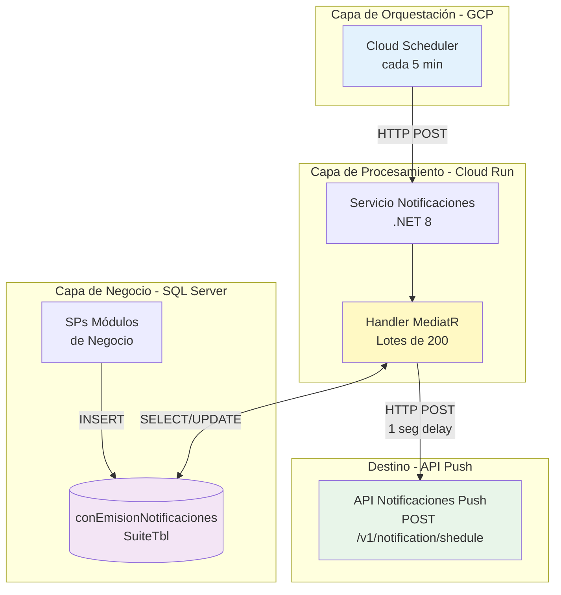
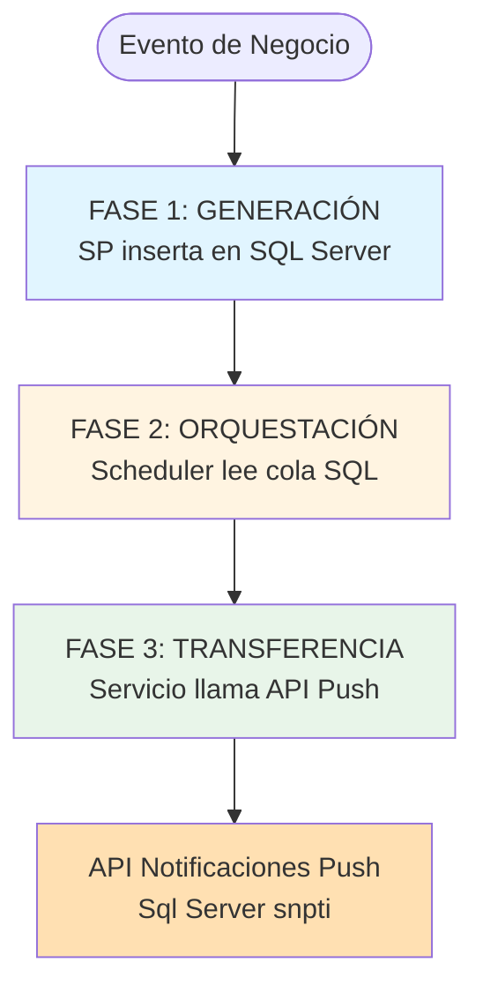
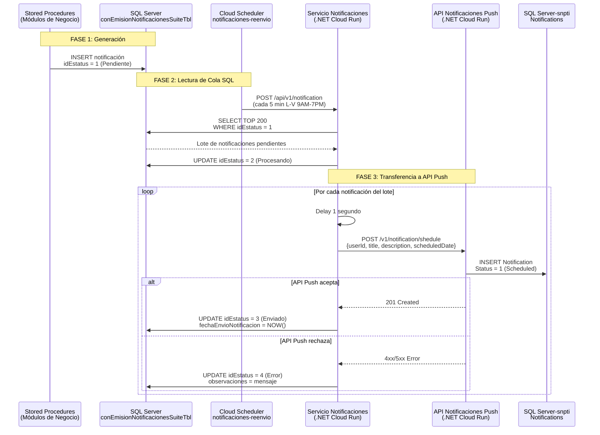
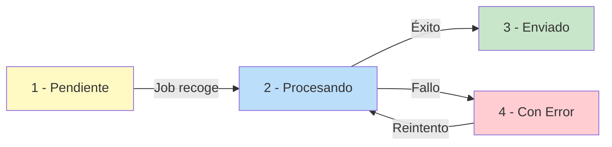
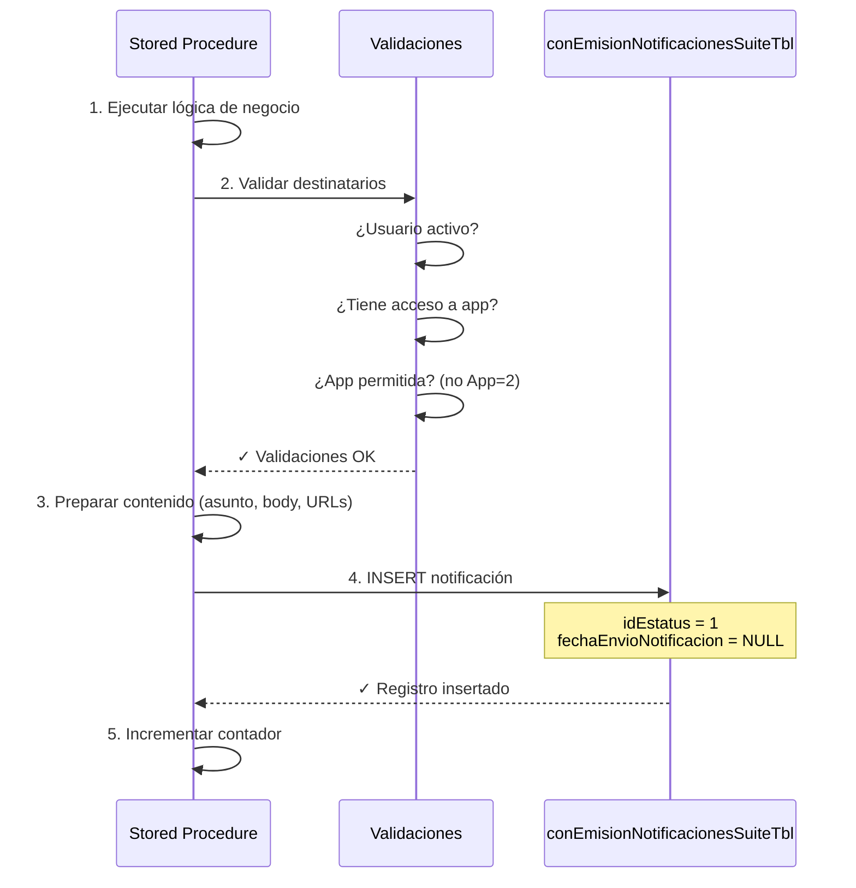

# Sistema de Notificaciones AppSuite - Sistema de Orquestación

> **Audiencia:** Arquitectos, Desarrolladores y Equipo de Operaciones  
> **Versión:** 1.0  
> **Última actualización:** Diciembre 2025  
> **Alcance:** SQL Server → Scheduler → Servicio Notificaciones → API Push

## 🎯 Resumen Ejecutivo

El sistema de orquestación de notificaciones es responsable de **transferir notificaciones** desde la base de datos legacy (SQL Server) hacia la API de Notificaciones Push de AppSuite.

### Alcance de Este Documento

Este documento cubre únicamente las **primeras 3 fases** del sistema:
1. **Generación:** SPs insertan en SQL Server
2. **Orquestación:** Cloud Scheduler procesa cola
3. **Transferencia:** Servicio llama a API Push

### Características Principales

- 📬 **Cola centralizada** en SQL Server (`conEmisionNotificacionesSuiteTbl`)
- 🔄 **Procesamiento asíncrono** mediante Cloud Scheduler + Cloud Run
- ⚡ **Procesamiento por lotes** de hasta 200 notificaciones con rate limiting
- ✅ **Trazabilidad completa** del ciclo de vida (4 estados)
- 🔁 **Reintento manual** de notificaciones fallidas
- 📊 **Auditoría y monitoreo** con timestamps y mensajes de error
- 🛡️ **Prevención de duplicados** mediante validación de procesos activos

### Arquitectura de Alto Nivel (Sistema de Orquestación)



## 🏛️ Decisiones Arquitectónicas

### ¿Por qué una cola en SQL Server y no mensajería (Pub/Sub, RabbitMQ, etc.)?

| Aspecto | Decisión | Justificación |
|---------|----------|---------------|
| **Persistencia** | SQL Server | Los datos de negocio ya están en SQL Server. Evita duplicación de datos y mantiene consistencia transaccional. |
| **Simplicidad** | Sin broker adicional | No requiere infraestructura adicional, reduce puntos de falla y costos operativos. |
| **Auditoría** | Tabla relacional | Consultas SQL estándar para reportes y análisis. Trazabilidad nativa con timestamps. |
| **Reintentos** | Control manual | Permite análisis de errores antes de reintentar. Evita loops infinitos. |
| **Transaccionalidad** | ACID en SQL | Los SPs insertan notificaciones en la misma transacción que la lógica de negocio. |

### Limitaciones Conocidas

| Limitación | Impacto | Mitigación |
|------------|---------|------------|
| **Sin reintentos automáticos** | Notificaciones fallidas requieren intervención manual | Script SQL documentado para reintentos. Considerar implementar en roadmap. |
| **Delay de hasta 5 minutos** | Notificaciones no son en tiempo real | Aceptable para el caso de uso actual (recibos, campañas). |
| **Rate limiting de 1 seg** | Throughput máximo ~3,600 notif/hora | Suficiente para volumen actual. Monitorear crecimiento. |
| **Lotes de 200** | Procesos grandes pueden requerir múltiples ejecuciones | Cloud Run tiene timeout de 3 min. Lotes de 200 completan en ~200 seg. |

## 🏗️ Cómo Funciona el Sistema

### Visión General del Flujo

El sistema funciona en 3 fases secuenciales:



### Fase 1: Generación de Notificaciones

Cuando ocurre el procesamiento de las notificaciones de conProcesosTbl de tipo push(ej: dispersión de préstamos, generación de recibos, campañas), los procedimientos almacenados de los motivos de correo del módulo correspondiente **registran** la notificación en la tabla central(conEmisionNotificacionesTbl).

**¿Qué sucede?**
1. El SP valida que el usuario destinatario esté activo
2. Verifica que el usuario tenga acceso a la aplicación
3. Prepara el contenido (asunto, cuerpo, URLs)
4. Inserta un registro en `conEmisionNotificacionesSuiteTbl` con estado **Pendiente**

### Fase 2: Almacenamiento en Cola

La tabla `conEmisionNotificacionesSuiteTbl` actúa como una **cola persistente** que almacena:

| Dato | Propósito |
|------|-----------|
| **idSession** | Agrupa notificaciones del mismo proceso/lote |
| **idUsuarioDestinatario** | Identifica a quién va dirigida |
| **asunto + body** | Contenido de la notificación |
| **urlArchivos** | Enlaces a documentos adjuntos |
| **idEstatus** | Estado actual (1=Pendiente, 2=Procesando, 3=Enviado, 4=Error) |
| **fechaEnvioNotificacion** | Timestamp de cuándo se envió (NULL si está pendiente) |

### Fase 3: Procesamiento y Transferencia a API Push

Un **Cloud Scheduler** (`notificaciones-reenvio-notificaciones` en proyecto `plowserve`) invoca periódicamente el endpoint del Servicio Notificaciones, que lee la cola de SQL Server(ncti) y transfiere las notificaciones a la API Push de AppSuite.

**Flujo del Sistema de Orquestación (hasta API Push):**



### Explicación Detallada de Cada Fase

#### **FASE 1: Generación de Notificaciones**
- **Responsable:** Stored Procedures de módulos de negocio
- **Acción:** INSERT en `conEmisionNotificacionesSuiteTbl`
- **Estado inicial:** `idEstatus = 1` (Pendiente)
- **Base de datos:** SQL Server
- **Trigger:** Eventos de negocio (dispersión de préstamos, generación de recibos, campañas, etc.)

#### **FASE 2: Lectura de Cola SQL Server**
- **Scheduler:** `notificaciones-reenvio-notificaciones` (proyecto `plowserve`)
- **Endpoint:** `POST https://servicionotificaciones-355837773731.us-central1.run.app/api/v1/notification`
- **Frecuencia:** Cada 5 minutos
- **Función:** Lee notificaciones pendientes de SQL Server en lotes de 200
- **Protecciones:**
  - Validación de proceso activo (previene duplicados)
  - Procesamiento por lotes
  - Rate limiting de 1 segundo entre envíos

#### **FASE 3: Transferencia a API Push**
- **Servicio origen:** `servicionotificaciones` (.NET Cloud Run)
- **Endpoint destino:** `POST /v1/notification/shedule` (API Push)
- **URL:** `https://servicionotificaciones-355837773731.us-central1.run.app/api/v1/notification/shedule`
- **Función:** Por cada notificación del lote, llama a la API Push para programarla
- **Datos transferidos:**
  - `ApplicationIdDestination`: ID de AppSuite
  - `ApplicationIdOrigin`: ID del módulo origen
  - `UserId`: Usuario destinatario
  - `Title`: Asunto (campo `asunto` de SQL)
  - `Description`: Cuerpo (campo `body` de SQL)
  - `ScheduledDate`: NOW() - se procesa inmediatamente
  - `Data`: Metadata (RedirectMode: "webview", etc.)
- **Estado en SQL tras éxito:** `idEstatus = 3` (Enviado) + `fechaEnvioNotificacion` poblada
- **Estado en SQL tras error:** `idEstatus = 4` (Error) + mensaje en `observaciones`

### Estados del Sistema de Orquestación

El Servicio de Notificaciones maneja 4 estados en la tabla `conEmisionNotificacionesSuiteTbl` de SQL Server:

### Características Clave del Sistema de Orquestación

| Característica | Descripción | Beneficio |
|----------------|-------------|-----------|
| **Cola persistente en SQL** | `conEmisionNotificacionesSuiteTbl` almacena todas las notificaciones generadas | Garantiza que ninguna notificación se pierda |
| **Scheduler periódico** | Cloud Scheduler invoca cada 5 minutos | Procesamiento automático sin intervención manual |
| **Protección concurrencia** | Validación de procesos activos antes de leer cola | Previene envíos duplicados |
| **Rate limiting** | 1 segundo de espera entre llamadas a API Push | Evita saturación del servicio destino |
| **Procesamiento por lotes** | 200 notificaciones por ejecución | Optimiza throughput sin sobrecargar sistema |
| **Trazabilidad completa** | Estados + timestamps + observaciones | Auditoría del flujo de cada notificación |
| **Manejo de errores** | Estado 4 (Error) + mensaje descriptivo | Facilita diagnóstico y reintentos manuales |
| **Desacoplamiento** | Sistema independiente de la API Push | Cada componente puede evolucionar independientemente |

## 📋 Tabla Central: `conEmisionNotificacionesSuiteTbl`


Esta tabla es el **corazón del sistema**. Almacena todas las notificaciones en cola.

#### Estructura y Significado de Campos

```sql
CREATE TABLE dbo.conEmisionNotificacionesSuiteTbl
(
    -- Identificación
    idEmision                   BIGINT IDENTITY(1,1) NOT NULL,  -- ID único de la notificación
    idSession                   VARCHAR(30) NOT NULL,           -- Agrupa notificaciones del mismo proceso
    
    -- Clasificación
    idAplicacion                SMALLINT NOT NULL,              -- Módulo origen (34=Campañas, etc.)
    idMotivoCorreo              SMALLINT NOT NULL,              -- Tipo de notificación
    
    -- Destinatario
    idUsuarioDestinatario       INTEGER NOT NULL,               -- Usuario que recibirá la notificación
    
    -- Contenido
    asunto                      VARCHAR(1000) NOT NULL,         -- Título de la notificación
    body                        VARCHAR(8000) NOT NULL,         -- Cuerpo del mensaje (puede incluir HTML)
    urlArchivos                 VARCHAR(2000) NULL,             -- Links a documentos/archivos adjuntos
    
    -- Control y Auditoría
    observaciones               VARCHAR(500) NULL,              -- Notas adicionales o mensajes de error
    fechaEnvioNotificacion      DATETIME NULL,                  -- Cuándo se envió (NULL = no enviada aún)
    idEstatus                   TINYINT NOT NULL DEFAULT 1,     -- 1=Pendiente, 2=Procesando, 3=Enviado, 4=Error
    idUsuarioAct                INTEGER NOT NULL,               -- Quién creó el registro
    fechaAct                    DATETIME NOT NULL DEFAULT GETDATE(), -- Cuándo se creó
    
    CONSTRAINT PK_conEmisionNotificacionesSuiteTbl PRIMARY KEY (idEmision)
)
```

#### Índices para Rendimiento

Los índices están diseñados para las consultas más frecuentes:

| Índice | Columna | ¿Para qué se usa? |
|--------|---------|-------------------|
| **IX_idSession** | idSession | Consultar todas las notificaciones de un proceso específico |
| **IX_idUsuarioDestinatario** | idUsuarioDestinatario | Ver notificaciones de un usuario |
| **IX_idEstatus** | idEstatus | **CRÍTICO**: El job busca notificaciones pendientes `WHERE idEstatus = 1` |
| **IX_fechaAct** | fechaAct | Ordenar notificaciones por antigüedad, limpieza de datos antiguos |

### Catálogo de Estados



| Estado | Valor | Significado | ¿Cuándo se usa? |
|--------|-------|-------------|-----------------|
| **Pendiente** | 1 | Notificación registrada, esperando procesamiento | Estado por defecto al insertar |
| **Procesando** | 2 | El job está intentando enviarla | Mientras el servicio de notificaciones trabaja |
| **Enviado** | 3 | Envío exitoso, `fechaEnvioNotificacion` poblada | Cuando el servicio confirma recepción |
| **Con Error** | 4 | Fallo en el envío, revisar `observaciones` | Si el servicio retorna error o timeout |

## 🔌 Integración: ¿Cómo se Generan las Notificaciones?

### Patrón de Integración Estándar

**Todos los procedimientos siguen el mismo patrón** de 5 pasos:



## ⚙️ Procesamiento: Detalles de Implementación

El procesamiento de notificaciones se realiza en **dos etapas** con dos servicios independientes orquestados por Cloud Schedulers.

### Configuración de Cloud Schedulers

#### **Scheduler 1: Lectura de Cola SQL** (`notificaciones-reenvio-notificaciones`)

| Parámetro | Valor | Descripción |
|-----------|-------|-------------|
| **Nombre** | `notificaciones-reenvio-notificaciones` | Identificador del job |
| **Proyecto GCP** | `plowserve` | Proyecto de producción |
| **Región** | `us-central1` | Central US (Iowa) |
| **Endpoint** | `POST https://servicionotificaciones-355837773731.us-central1.run.app/api/v1/notification` | URL del servicio notificaciones |
| **Schedule (cron)** | `*/5 * * * *` | Cada 5 min (GMT-6 México) |
| **Timeout** | `180 segundos` | Máximo 3 minutos por ejecución |
| **Retry Config** | `max-retry-duration: 0s` | Sin reintentos automáticos |
| **Estado** | `ENABLED` | Activo en producción |
| **Base de Datos** | SQL Server(ncti) | `conEmisionNotificacionesSuiteTbl` |
| **Función** | Lee cola SQL y programa en API Push | PASO 1 y 2 del flujo |

---

### Componentes del Sistema de Orquestación

#### **FASE 1: Generación**
| Componente | Detalle |
|------------|---------|
| **Responsable** | Stored Procedures de módulos de negocio |
| **Acción** | INSERT en `conEmisionNotificacionesSuiteTbl` |
| **Base de Datos** | SQL Server |
| **Estado** | `idEstatus = 1` (Pendiente) |

#### **FASE 2: Orquestación (Cloud Scheduler)**
| Componente | Detalle |
|------------|---------|
| **Scheduler** | `notificaciones-reenvio-notificaciones` |
| **Proyecto GCP** | `plowserve` |
| **Frecuencia** | Cada 5 min |
| **Endpoint** | `POST /api/v1/notification` |
| **Cloud Run** | `servicionotificaciones-355837773731.us-central1.run.app` |

#### **FASE 3: Transferencia (Servicio → API Push)**
| Componente | Detalle |
|------------|---------|
| **Servicio Origen** | `Corp.Servicionotificaciones` (.NET 8) |
| **Handler** | `SendNotificationCommandHandler` |
| **Servicio** | `NotificationSuiteService` |
| **Endpoint Destino** | `POST /v1/notification/shedule` |
| **URL** | `https://push-api-development-800075027307.us-central1.run.app/` |
| **Lotes** | 200 notificaciones |
| **Rate Limiting** | 1 segundo entre envíos |
| **Estado SQL éxito** | `idEstatus = 3` (Enviado) + `fechaEnvioNotificacion` |
| **Estado SQL error** | `idEstatus = 4` (Error) + `observaciones` |

## 🚨 Runbook Operativo

### Escenario 1: Acumulación de Notificaciones Pendientes

**Síntoma:** Miles de notificaciones con `idEstatus = 1` sin procesar

**Diagnóstico:**
```sql
-- Verificar estado de la cola
SELECT 
    idEstatus,
    COUNT(*) AS Total,
    MIN(fechaAct) AS MasAntigua,
    MAX(fechaAct) AS MasReciente
FROM conEmisionNotificacionesSuiteTbl
GROUP BY idEstatus
```

**Posibles causas y soluciones:**

1. **Scheduler deshabilitado**
   ```bash
   # Verificar estado
   gcloud scheduler jobs describe notificaciones-reenvio-notificaciones \
     --location=us-central1 --project=plowserve | grep state
   
   # Si está PAUSED, reanudar
   gcloud scheduler jobs resume notificaciones-reenvio-notificaciones \
     --location=us-central1 --project=plowserve
   ```

2. **Cloud Run caído/no responde**
   ```bash
   # Ver logs del Cloud Run
   gcloud logging read "resource.type=cloud_run_revision AND resource.labels.service_name=servicionotificaciones" \
     --limit=50 --project=plowserve --format=json
   
   # Verificar métricas del servicio
   gcloud run services describe servicionotificaciones \
     --region=us-central1 --project=plowserve
   ```

**Acción correctiva:**
```bash
# Ejecutar manualmente si es urgente
gcloud scheduler jobs run notificaciones-reenvio-notificaciones \
  --location=us-central1 --project=plowserve
```

---

### Escenario 2: Notificaciones Atascadas en "Procesando"

**Síntoma:** Registros con `idEstatus = 2` por más de 10 minutos

**Diagnóstico:**
```sql
SELECT 
    idEmision,
    idUsuarioDestinatario,
    asunto,
    fechaAct,
    DATEDIFF(MINUTE, fechaAct, GETDATE()) AS MinutosAtascado
FROM conEmisionNotificacionesSuiteTbl
WHERE idEstatus = 2
  AND fechaAct < DATEADD(MINUTE, -10, GETDATE())
ORDER BY fechaAct
```

**Causa:** El procesador crasheó o el Cloud Run se reinició mientras procesaba

**Solución:**
```sql
-- Reset a estado Pendiente
UPDATE conEmisionNotificacionesSuiteTbl
SET idEstatus = 1,
    observaciones = ISNULL(observaciones + ' | ', '') + 'Reset manual por timeout: ' + CONVERT(VARCHAR, GETDATE(), 120)
WHERE idEstatus = 2
  AND fechaAct < DATEADD(MINUTE, -10, GETDATE())

-- Verificar cuántos se resetearon
SELECT @@ROWCOUNT AS RegistrosReseteados
```

---

### Escenario 3: Alta Tasa de Errores

**Síntoma:** Muchas notificaciones con `idEstatus = 4`

**Diagnóstico:**
```sql
-- Top 10 errores más comunes
SELECT TOP 10
    LEFT(observaciones, 100) AS MensajeError,
    COUNT(*) AS Cantidad,
    MIN(fechaAct) AS PrimerError,
    MAX(fechaAct) AS UltimoError
FROM conEmisionNotificacionesSuiteTbl
WHERE idEstatus = 4
  AND fechaAct >= DATEADD(HOUR, -24, GETDATE())
GROUP BY LEFT(observaciones, 100)
ORDER BY COUNT(*) DESC
```

**Causas comunes:**

1. **API Push caída o inaccesible**
   - Verificar conectividad: `curl -X POST [URL_API_PUSH]/v1/notification/shedule`
   - Revisar logs de la API Push
   - Verificar estado del Cloud Run en proyecto plowserve

2. **Timeout en envíos**
   - Considerar aumentar timeout del Cloud Run
   - Revisar delay entre envíos (actualmente 1 seg)

3. **Errores de validación en API Push (ApplicationIdDestination no existe, etc.)**
   - Revisar logs de la API Push para detalles del error
   - Verificar datos maestros (aplicaciones registradas)

**Acción correctiva:**
- Una vez resuelto el problema raíz, ejecutar script de reintento manual
---

### Escenario 4: Rendimiento Degradado

**Síntoma:** El procesamiento es lento, notificaciones tardan >30 minutos

**Diagnóstico:**
```sql
-- Ver tiempo promedio de procesamiento últimas 24h
SELECT 
    AVG(DATEDIFF(MINUTE, fechaAct, fechaEnvioNotificacion)) AS MinutosPromedio,
    MIN(DATEDIFF(MINUTE, fechaAct, fechaEnvioNotificacion)) AS MinutosMinimo,
    MAX(DATEDIFF(MINUTE, fechaAct, fechaEnvioNotificacion)) AS MinutosMaximo,
    COUNT(*) AS TotalEnviadas
FROM conEmisionNotificacionesSuiteTbl
WHERE idEstatus = 3
  AND fechaEnvioNotificacion >= DATEADD(HOUR, -24, GETDATE())
  AND fechaEnvioNotificacion IS NOT NULL
```

**Posibles causas:**

1. **Volumen excesivo**
   - Verificar si hay picos de generación de notificaciones
   - Considerar aumentar frecuencia del scheduler (de 5 min a 2 min)
   - Aumentar tamaño de lote (de 200 a 500)

2. **Fragmentación de índices**
   - Ejecutar query de verificación de fragmentación (ver sección Mantenimiento)
   - Reorganizar/reconstruir índices según nivel de fragmentación

3. **Latencia en servicio de Notification Suite**
   - Medir tiempo de respuesta del servicio externo
   - Revisar logs del Cloud Run para identificar cuello de botella

---

### Troubleshooting Rápido

**Problema:** El scheduler se ejecuta pero no procesa notificaciones

**Diagnóstico:**
```sql
-- ¿Hay registros en estado "Procesando" atascados?
SELECT * FROM conEmisionNotificacionesSuiteTbl 
WHERE idEstatus = 2
ORDER BY fechaAct
```

**Solución:**
```sql
-- Reset manual de registros atascados (más de 1 hora)
UPDATE conEmisionNotificacionesSuiteTbl
SET idEstatus = 1,  -- Volver a Pendiente
    observaciones = 'Reset manual: ' + CONVERT(VARCHAR, GETDATE(), 120)
WHERE idEstatus = 2
  AND fechaAct < DATEADD(HOUR, -1, GETDATE())
```

---

**Problema:** Errores masivos en el envío

**Diagnóstico:**
```sql
-- Ver los mensajes de error más comunes
SELECT TOP 10 
    observaciones,
    COUNT(*) AS Cantidad
FROM conEmisionNotificacionesSuiteTbl
WHERE idEstatus = 4
  AND fechaAct >= DATEADD(HOUR, -1, GETDATE())
GROUP BY observaciones
ORDER BY COUNT(*) DESC
```

**Acciones:**
- Si es error de conectividad: Verificar estado del servicio de notificaciones
- Si es timeout: Considerar aumentar el delay entre envíos
- Si es error de validación: Revisar formato de los datos generados por los SPs

## 📈 Capacidad y Escalabilidad

### Límites Actuales

| Componente | Límite Actual | Límite Técnico | Comentarios |
|------------|---------------|----------------|-------------|
| **Frecuencia scheduler** | Cada 5 min | Cada 1 min (GCP) | Ajustable en cron expression |
| **Tamaño de lote** | 200 notif | ~600 (timeout 3 min) | 1 seg delay × 200 = ~200 seg |
| **Rate limiting** | 1 notif/seg | Configurable | Previene saturación del servicio destino |
| **Timeout Cloud Run** | 180 seg | 3600 seg (1 hora) | Configuración de Cloud Run |
| **Capacidad horaria** | ~2,400 notif/h | ~7,200 con ajustes | 12 ejecuciones × 200 notif |

## 🛠️ Mantenimiento y Limpieza

### Purga de Notificaciones Antiguas

```sql
-- Eliminar notificaciones enviadas hace más de 90 días
-- (mantiene las con error para análisis)
DELETE FROM conEmisionNotificacionesSuiteTbl
WHERE idEstatus = 3  -- Enviado
  AND fechaEnvioNotificacion < DATEADD(day, -90, GETDATE())

-- Ejecutar mensualmente para evitar crecimiento excesivo
```

### Reintento Manual de Notificaciones con Error

⚠️ **IMPORTANTE:** El reintento automático NO está implementado. Los reintentos deben ejecutarse manualmente mediante este script SQL.

```sql
-- Reintentar notificaciones que fallaron hace más de 1 hora (EJECUCIÓN MANUAL)
UPDATE conEmisionNotificacionesSuiteTbl
SET idEstatus = 1,  -- Volver a Pendiente
    observaciones = observaciones + ' | Reintento: ' + CONVERT(VARCHAR, GETDATE(), 120)
WHERE idEstatus = 4  -- Con Error
  AND fechaAct < DATEADD(HOUR, -1, GETDATE())
  AND observaciones NOT LIKE '%Reintento%Reintento%'  -- Máximo 2 reintentos
```

## 📦 Especificaciones Técnicas

### Stack Tecnológico

| Capa | Tecnología | Versión |
|------|------------|---------||
| **Backend** | .NET | 8.0 |
| **Arquitectura** | Clean Architecture + CQRS | MediatR |
| **ORM** | Entity Framework Core | 8.x |
| **Base de Datos** | SQL Server(ncti) | 2019+ |
| **Cloud Platform** | Google Cloud Platform | - |
| **Compute** | Cloud Run | Gen 2 |
| **Orchestration** | Cloud Scheduler | - |
| **Logging** | Cloud Logging | - |
| **Monitoring** | Cloud Monitoring | - |

### Componentes del Sistema

| Componente | Tipo | Propósito | Ubicación |
|------------|------|-----------|-------------|
| `conEmisionNotificacionesSuiteTbl` | Tabla SQL | Cola persistente de notificaciones | SQL Server NCTI |
| Índices (4) | Índices SQL | Optimización de consultas del procesador | SQL Server NCTI |
| 10 Stored Procedures | SPs | Generadores de notificaciones por módulo | SQL Server NCTI |
| `SendNotificationCommandHandler` | C# Handler | Procesador de cola (lotes de 200) | Cloud Run |
| Cloud Scheduler | GCP Scheduler | Trigger automático cada 5 min | GCP us-central1 |
| `NotificationController` | API Endpoint | POST /api/v1/notification | Cloud Run |
| `INotificationSuiteService` | Servicio HTTP | Integración con API Push | Cloud Run |
| Catálogo de Estados | Datos maestros | Define estados del ciclo de vida (1-4) | SQL Server NCTI |


## 📚 Información Técnica Adicional

### Archivos Modificados en Feature

| Tipo | Archivo | Función |
|------|---------|---------|
| 📋 Data | `Insert_catGeneralesTbl_conEmisionNotificacionesSuiteTbl_idEstatus.sql` | Catálogo de estados (1-4) |
| 🗄️ Table | `conEmisionNotificacionesSuiteTbl.sql` | Tabla principal de cola |
| 🔧 SP | `Spc_listaDatosNotificacion0.sql` | Notificaciones generales Origen 8 |
| 🔧 SP | `Spp_EnviaNotificacionesCampana.sql` | Campañas masivas (App 34) |
| 🔧 SP | `Spp_CorreoPrestamosDispersados.sql` | Notificación de préstamos dispersados |
| 🔧 SP | `Spp_CorreosRecibosEspeciales.sql` | Recibos especiales (Origen 8) |
| 🔧 SP | `Spp_CorreosRecibosGenericos.sql` | Recibos genéricos de nómina |
| 🔧 SP | `Spp_ConfirmaDepCreditosEspeciales.sql` | Confirmación de créditos especiales |
| 🔧 SP | `Spp_EnviaEstadisticasPush.sql` | Estadísticas push a usuarios |
| 🔧 SP | `Spp_EnviaNotificacionMovEmpleadosEL.sql` | Movimientos de empleados |
| 🔧 SP | `Spp_enviaCorreoIncidencia.sql` | Notificaciones de incidencias |
| 🔧 SP | `Spp_ProcesaPushV7.sql` | Procesamiento push con filtro origen |

**Total:** 12 objetos base de datos (2 nuevos + 10 modificados) + componentes del servicio

### Componentes del Servicio de Procesamiento

| Tipo | Archivo | Función |
|------|---------|---------|
| 🎮 Controller | `NotificationController.cs` | Endpoint POST /api/v1/notification |
| 📨 Command | `SendNotificationCommand.cs` | Comando MediatR para procesar cola |
| ⚙️ Handler | `SendNotificationCommandHandler.cs` | Lógica de procesamiento por lotes |
| 🗄️ Repository | `ConEmisionNotificacionesSuiteTblRepository.cs` | Acceso a datos de la cola |
| 📡 Service | `NotificationSuiteService.cs` | Integración con servicio push AppSuite |
| 🏗️ Entity | `ConEmisionNotificacionesSuite.cs` | Entidad del dominio |
| 🔧 Config | `ConEmisionNotificacionesSuiteEntityType.cs` | Configuración EF Core |

### Infraestructura Cloud

| Componente | Servicio | Detalle |
|------------|----------|---------|
| **Procesador** | Cloud Run | `servicionotificaciones-development-782007426780.us-central1.run.app` |
| **Scheduler** | Cloud Scheduler | `notificaciones-reenvio-notificaciones` |
| **Proyecto GCP** | Google Cloud | `plowserve` |
| **Región** | GCP Region | `us-central1` |
| **Base de Datos** | SQL Server | `NCTI` database |

---

**Documentación generada:** Diciembre 2025  
**Versión:** 2.0 - Sistema de Orquestación (SQL → API Push)  
**Autor:** Edgar R. Rodriguez
