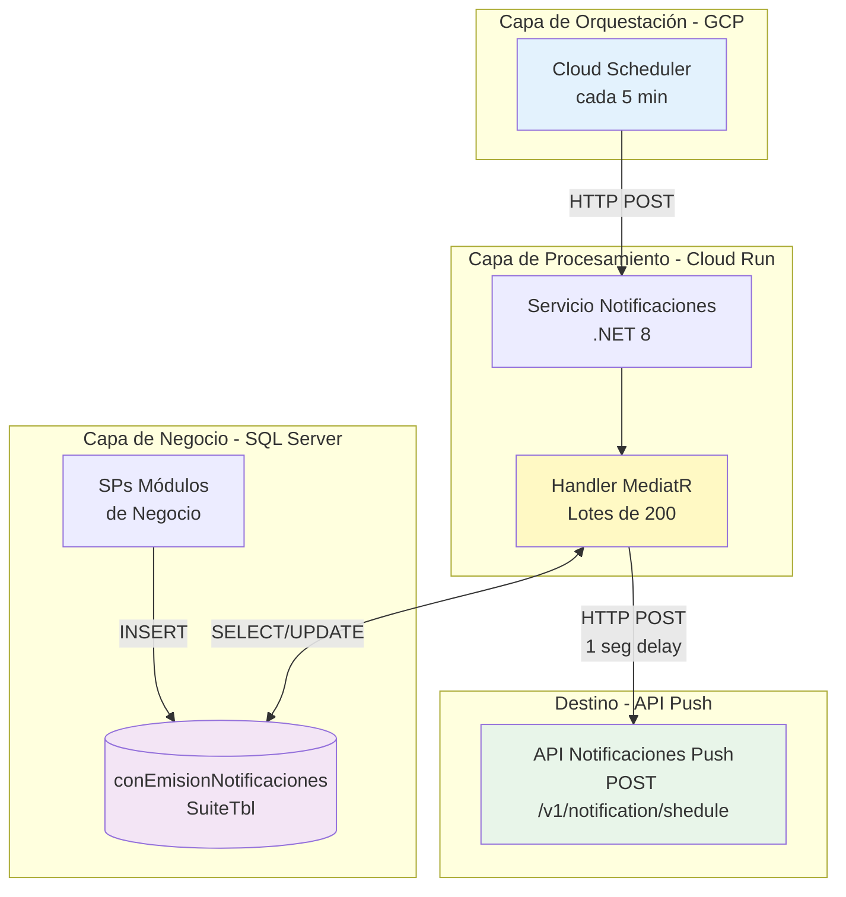
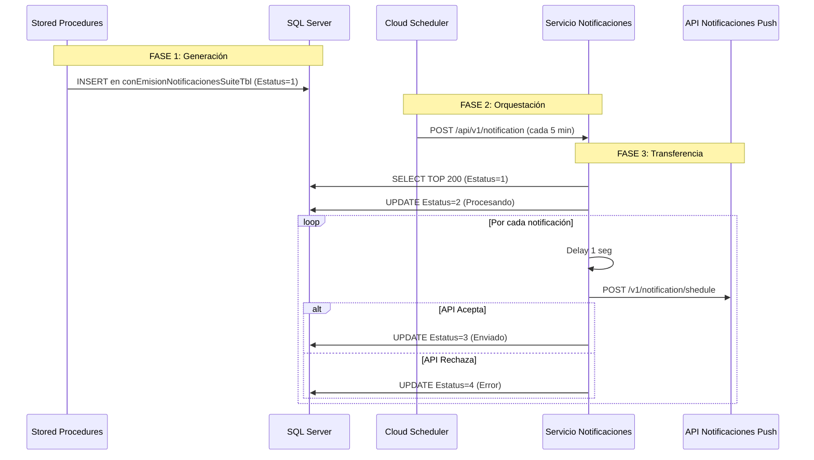
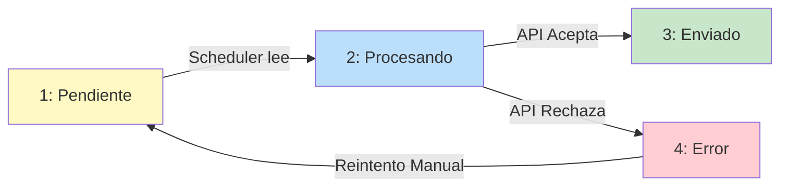

# Sistema de Notificaciones AppSuite - Sistema de Orquestación

> **Audiencia:** Arquitectos, Desarrolladores y Equipo de Operaciones  
> **Versión:** 1.0  
> **Última actualización:** Diciembre 2025  
> **Alcance:** SQL Server → Scheduler → Servicio Notificaciones → API Push

## 🎯 Resumen Ejecutivo

El sistema de orquestación de notificaciones es responsable de **transferir notificaciones** desde la base de datos legacy (SQL Server) hacia la API de Notificaciones Push de AppSuite.

### Alcance de Este Documento

Este documento cubre únicamente las **primeras 3 fases** del sistema:
1. **Generación:** SPs insertan en SQL Server
2. **Orquestación:** Cloud Scheduler procesa cola
3. **Transferencia:** Servicio llama a API Push

### Características Principales

- 📬 **Cola centralizada** en SQL Server (`conEmisionNotificacionesSuiteTbl`)
- 🔄 **Procesamiento asíncrono** mediante Cloud Scheduler + Cloud Run
- ⚡ **Procesamiento por lotes** de hasta 200 notificaciones con rate limiting
- ✅ **Trazabilidad completa** del ciclo de vida (4 estados)
- 🔁 **Reintento manual** de notificaciones fallidas
- 📊 **Auditoría y monitoreo** con timestamps y mensajes de error
- 🛡️ **Prevención de duplicados** mediante validación de procesos activos

### Arquitectura de Alto Nivel (Sistema de Orquestación)



## 🏛️ Decisiones Arquitectónicas

### ¿Por qué una cola en SQL Server y no mensajería (Pub/Sub, RabbitMQ, etc.)?

| Aspecto | Decisión | Justificación |
|---------|----------|---------------|
| **Persistencia** | SQL Server | Los datos de negocio ya están en SQL Server. Evita duplicación de datos y mantiene consistencia transaccional. |
| **Simplicidad** | Sin broker adicional | No requiere infraestructura adicional, reduce puntos de falla y costos operativos. |
| **Auditoría** | Tabla relacional | Consultas SQL estándar para reportes y análisis. Trazabilidad nativa con timestamps. |
| **Reintentos** | Control manual | Permite análisis de errores antes de reintentar. Evita loops infinitos. |
| **Transaccionalidad** | ACID en SQL | Los SPs insertan notificaciones en la misma transacción que la lógica de negocio. |

### Limitaciones Conocidas

| Limitación | Impacto | Mitigación |
|------------|---------|------------|
| **Sin reintentos automáticos** | Notificaciones fallidas requieren intervención manual | Script SQL documentado para reintentos. Considerar implementar en roadmap. |
| **Delay de hasta 5 minutos** | Notificaciones no son en tiempo real | Aceptable para el caso de uso actual (recibos, campañas). |
| **Rate limiting de 1 seg** | Throughput máximo ~3,600 notif/hora | Suficiente para volumen actual. Monitorear crecimiento. |
| **Lotes de 200** | Procesos grandes pueden requerir múltiples ejecuciones | Cloud Run tiene timeout de 3 min. Lotes de 200 completan en ~200 seg. |

## 🏗️ Cómo Funciona el Sistema

El sistema transfiere notificaciones desde una cola en SQL Server a la API de Notificaciones Push a través de un proceso asíncrono orquestado por Cloud Scheduler.

### Fases del Proceso
1.  **Generación:** Un Stored Procedure inserta la notificación en `conEmisionNotificacionesSuiteTbl` con estado `Pendiente`.
2.  **Orquestación:** Cada 5 minutos, un Cloud Scheduler invoca al *Servicio Notificaciones*.
3.  **Transferencia:** El servicio lee un lote de 200 notificaciones, las marca como `Procesando` y las envía una por una (con un delay de 1 segundo) a la API Push. El estado final en SQL Server será `Enviado` o `Error`.

### Flujo de Interacción
Este diagrama muestra la secuencia de llamadas entre los componentes:

### Flujo de Interacción
Este diagrama muestra la secuencia de llamadas entre los componentes:



### Ciclo de Vida de una Notificación (Estados)



| Estado | Valor | Significado |
|---|---|---|
| **Pendiente** | 1 | Esperando ser procesada por el scheduler. |
| **Procesando** | 2 | El servicio la está transfiriendo a la API Push. |
| **Enviado** | 3 | La API Push la recibió y programó correctamente. |
| **Con Error** | 4 | La API Push la rechazó. El motivo queda en `observaciones`. |

## 🚨 Runbook Operativo y Monitoreo

Esta sección consolida los escenarios operativos clave y las consultas para diagnosticar y resolver problemas.

**Síntoma:** Miles de notificaciones con `idEstatus = 1` sin procesar

**Diagnóstico:**
```sql
-- Verificar estado de la cola
SELECT 
    idEstatus,
    COUNT(*) AS Total,
    MIN(fechaAct) AS MasAntigua,
    MAX(fechaAct) AS MasReciente
FROM conEmisionNotificacionesSuiteTbl
GROUP BY idEstatus
```

**Posibles causas y soluciones:**

1. **Scheduler deshabilitado**
   ```bash
   # Verificar estado
   gcloud scheduler jobs describe notificaciones-reenvio-notificaciones \
     --location=us-central1 --project=plowserve | grep state
   
   # Si está PAUSED, reanudar
   gcloud scheduler jobs resume notificaciones-reenvio-notificaciones \
     --location=us-central1 --project=plowserve
   ```

2. **Cloud Run caído/no responde**
   ```bash
   # Ver logs del Cloud Run
   gcloud logging read "resource.type=cloud_run_revision AND resource.labels.service_name=servicionotificaciones" \
     --limit=50 --project=plowserve --format=json
   
   # Verificar métricas del servicio
   gcloud run services describe servicionotificaciones \
     --region=us-central1 --project=plowserve
   ```

**Acción correctiva:**
```bash
# Ejecutar manualmente si es urgente
gcloud scheduler jobs run notificaciones-reenvio-notificaciones \
  --location=us-central1 --project=plowserve
```

---

### Escenario 2: Notificaciones Atascadas en "Procesando"

**Síntoma:** Registros con `idEstatus = 2` por más de 10 minutos

**Diagnóstico:**
```sql
SELECT 
    idEmision,
    idUsuarioDestinatario,
    asunto,
    fechaAct,
    DATEDIFF(MINUTE, fechaAct, GETDATE()) AS MinutosAtascado
FROM conEmisionNotificacionesSuiteTbl
WHERE idEstatus = 2
  AND fechaAct < DATEADD(MINUTE, -10, GETDATE())
ORDER BY fechaAct
```

**Causa:** El procesador crasheó o el Cloud Run se reinició mientras procesaba

**Solución:**
```sql
-- Reset a estado Pendiente
UPDATE conEmisionNotificacionesSuiteTbl
SET idEstatus = 1,
    observaciones = ISNULL(observaciones + ' | ', '') + 'Reset manual por timeout: ' + CONVERT(VARCHAR, GETDATE(), 120)
WHERE idEstatus = 2
  AND fechaAct < DATEADD(MINUTE, -10, GETDATE())

-- Verificar cuántos se resetearon
SELECT @@ROWCOUNT AS RegistrosReseteados
```

---

### Escenario 3: Alta Tasa de Errores

**Síntoma:** Muchas notificaciones con `idEstatus = 4`

**Diagnóstico:**
```sql
-- Top 10 errores más comunes
SELECT TOP 10
    LEFT(observaciones, 100) AS MensajeError,
    COUNT(*) AS Cantidad,
    MIN(fechaAct) AS PrimerError,
    MAX(fechaAct) AS UltimoError
FROM conEmisionNotificacionesSuiteTbl
WHERE idEstatus = 4
  AND fechaAct >= DATEADD(HOUR, -24, GETDATE())
GROUP BY LEFT(observaciones, 100)
ORDER BY COUNT(*) DESC
```

**Causas comunes:**

1. **API Push caída o inaccesible**
   - Verificar conectividad: `curl -X POST [URL_API_PUSH]/v1/notification/shedule`
   - Revisar logs de la API Push
   - Verificar estado del Cloud Run en proyecto plowserve

2. **Timeout en envíos**
   - Considerar aumentar timeout del Cloud Run
   - Revisar delay entre envíos (actualmente 1 seg)

3. **Errores de validación en API Push (ApplicationIdDestination no existe, etc.)**
   - Revisar logs de la API Push para detalles del error
   - Verificar datos maestros (aplicaciones registradas)

**Acción correctiva:**
- Una vez resuelto el problema raíz, ejecutar script de reintento manual
---

### Escenario 4: Rendimiento Degradado

**Síntoma:** El procesamiento es lento, las notificaciones tardan más de 15 minutos en pasar de `Pendiente` a `Enviado`.

**Diagnóstico:**
```sql
-- Ver tiempo promedio de procesamiento en las últimas 24h
SELECT 
    AVG(DATEDIFF(MINUTE, fechaAct, fechaEnvioNotificacion)) AS MinutosPromedio
FROM conEmisionNotificacionesSuiteTbl
WHERE idEstatus = 3
  AND fechaEnvioNotificacion >= DATEADD(HOUR, -24, GETDATE());
```

**Posibles Causas y Soluciones:**
1.  **Volumen Excesivo:**
    *   **Causa:** Picos de generación de notificaciones.
    *   **Solución:** Considerar aumentar la frecuencia del scheduler (de 5 a 2 min) o el tamaño del lote (de 200 a 400).
2.  **Fragmentación de Índices:**
    *   **Causa:** El índice sobre `idEstatus` está fragmentado.
    *   **Solución:** Reorganizar/reconstruir el índice `IX_idEstatus`.
3.  **Latencia en API Push:**
    *   **Causa:** La API Push responde lento.
    *   **Solución:** Revisar logs del Cloud Run del *Servicio Notificaciones* para identificar timeouts o latencia alta en las llamadas a la API Push.

## 📦 Matriz de Componentes e Infraestructura

| Capa | Componente | Tecnología/Servicio | Ubicación/Endpoint |
|---|---|---|---|
| **Datos** | `conEmisionNotificacionesSuiteTbl` | SQL Server | Base de Datos `NCTI` |
| | Stored Procedures (SPs) | T-SQL | Base de Datos `NCTI` |
| **Orquestación** | `notificaciones-reenvio-notificaciones` | GCP Cloud Scheduler | `us-central1`, Proyecto `plowserve` |
| **Procesamiento** | Servicio Notificaciones | .NET 8 / Cloud Run | `servicionotificaciones-development-782007426780.us-central1.run.app` |
| | `SendNotificationCommandHandler` | MediatR (C#) | Lógica de lotes y delays |
| **Integración** | API Notificaciones Push | .NET 8 / Cloud Run | `push-api-development-800075027307.us-central1.run.app/v1/notification/shedule` |

---

**Documentación generada:** Diciembre 2025  
**Versión:** 2.0 - Sistema de Orquestación (SQL → API Push)  
**Autor:** Edgar R. Rodriguez
