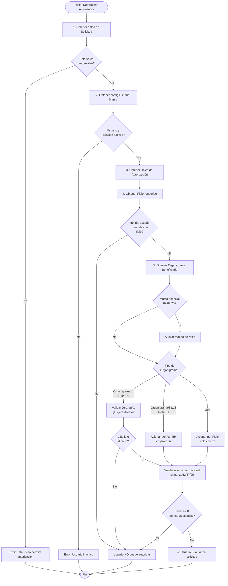

# Documentación Técnica: `prp_SolicitudesporAutorizar`

## Información General

| Propiedad | Valor |
|-----------|-------|
| **Nombre del Procedimiento** | `dbo.prp_SolicitudesporAutorizar` |
| **Base de Datos** | Control de Asistencia (CA) |
| **Objetivo** | Obtener el listado de solicitudes pendientes de autorizar para un usuario específico, basándose en su rol de autorización y nivel jerárquico |
| **Última Modificación** | 09-08-2024 |
| **Modificado Por** | Carlos Daniel Esquivel González |

---

## Arquitectura del Procedimiento

### Vista General

Este procedimiento almacenado es un componente crítico del sistema de autorización de solicitudes de asistencia. Su arquitectura se basa en:

1. **Validación multinivel** de permisos y configuraciones
2. **Consultas dinámicas** a servidor vinculado para obtener información de empleados
3. **Motor de reglas jerárquicas** para determinar el autorizador correcto
4. **Procesamiento por lotes** de múltiples solicitudes

### Componentes Principales

#### 1. **Módulo de Validación de Configuración**
- Valida la existencia y estado activo de la relación Usuario-Marca
- Verifica el estado del usuario en el sistema de seguridad
- Confirma la validez de la Marca Regla

#### 2. **Motor de Datos de Empleados**
- Conecta con servidor remoto mediante linked server
- Extrae información de plantilla de control de asistencia
- Construye organigrama y jerarquías dinámicamente

#### 3. **Motor de Autorización Jerárquica**
- Evalúa roles de autorización configurados
- Aplica lógica de jerarquía organizacional o por flujo
- Maneja casos especiales por marca (SOLUGLOB, TUM)

#### 4. **Procesador de Solicitudes**
- Filtra solicitudes pendientes por criterios múltiples
- Asigna autorizadores basándose en jerarquía
- Genera resultado final con información consolidada

---

## Diagrama de Secuencia

```mermaid
sequenceDiagram
    participant Cliente as Cliente/App
    participant SP as prp_SolicitudesporAutorizar
    participant Config as Tablas Configuración
    participant LinkedSrv as Servidor Vinculado (RH)
    participant TempTables as Tablas Temporales
    participant Solicitudes as Sistema Solicitudes

    Cliente->>SP: Ejecutar SP con parámetros
    Note over Cliente,SP: @PnidRelUsuarioMarca, @PnidRelacionLaboral,<br/>@PnidTipoSolicitud, @pnidEstatusSolicitud

    rect rgb(240, 248, 255)
        Note over SP,Config: FASE 1: Validación de Configuración
        SP->>Config: Validar configRelUsuarioMarcaTbl
        Config-->>SP: Retorna config (NivelJerarquía, Usuario, Marca)
        
        alt Configuración inválida
            SP-->>Cliente: Error (1-6): Config no válida
        end

        SP->>Config: Validar segUsuariosTbl
        Config-->>SP: Estado del usuario
        
        SP->>Config: Validar catMarcaReglaTbl
        Config-->>SP: Estado de Marca Regla
    end

    rect rgb(255, 248, 240)
        Note over SP,LinkedSrv: FASE 2: Obtención de Datos de Empleados
        SP->>Config: Obtener catAmbientesTbl (LinkServer, BD)
        Config-->>SP: Configuración de servidor
        
        SP->>LinkedSrv: SELECT rhPlantillaControlAsistenciaTbl
        Note over LinkedSrv: Consulta dinámica con filtros<br/>por Marca y TipoOperación
        LinkedSrv-->>SP: Datos de empleados
        
        SP->>TempTables: INSERT #temp_Empleados
    end

    rect rgb(240, 255, 240)
        Note over SP,TempTables: FASE 3: Construcción de Roles
        SP->>Config: SELECT configRelUserMarcaAutorizaTbl
        Config-->>SP: Roles de autorización del usuario
        
        SP->>TempTables: INSERT #temp_RolesUsuario
    end

    rect rgb(255, 240, 240)
        Note over SP,Solicitudes: FASE 4: Identificación de Solicitudes Pendientes
        SP->>Solicitudes: SELECT solicitudes POR AUTORIZAR
        Note over Solicitudes: Filtros: Marca, TipoSolicitud,<br/>Estados (POR AUTORIZAR, NUEVO)
        
        alt Marca especial (62/87 SOLUGLOB/TUM)
            SP->>SP: Ajustar idRolAutorizacion (40↔48, 41↔49)
        end
        
        Solicitudes-->>SP: Lista de solicitudes
        SP->>TempTables: INSERT #temp_SolicitudesPendientes
        
        alt Sin solicitudes pendientes
            SP-->>Cliente: Error 7: No hay solicitudes
        end
    end

    rect rgb(248, 240, 255)
        Note over SP,LinkedSrv: FASE 5: Procesamiento Iterativo de Solicitudes
        loop Para cada Rol del Usuario
            SP->>LinkedSrv: EXEC Spc_OrganigramaEmpleado
            LinkedSrv-->>SP: Organigrama del empleado autorizado
            SP->>TempTables: INSERT #temp_OrganigramaEmpleado
            
            loop Para cada Solicitud Pendiente
                SP->>SP: Obtener datos solicitud y empleado
                
                alt Organigrama = 1 (Jerarquía) Y Rol NO es RH
                    SP->>TempTables: Buscar Jefe Directo en organigrama
                    SP->>SP: Verificar si usuario es jefe del solicitante
                    SP->>TempTables: INSERT #temp_SolicitudesUsuario
                    
                else Organigrama IN (1,18) Y Rol es RH (3,4,6,7,41)
                    SP->>TempTables: Asignar directamente (sin jerarquía)
                    SP->>TempTables: INSERT #temp_SolicitudesUsuario
                    
                else Organigrama por Flujo
                    SP->>TempTables: Asignar por coincidencia de rol
                    SP->>TempTables: INSERT #temp_SolicitudesUsuario
                end
                
                SP->>TempTables: DELETE solicitud de #temp_SolicitudesPendientes
            end
            
            SP->>TempTables: Limpiar #temp_OrganigramaEmpleado
        end
    end

    rect rgb(255, 255, 240)
        Note over SP,LinkedSrv: FASE 6: Procesamiento Especial por Marca
        
        alt Marca = 1 (Ejecutivo MARS)
            loop Para cada Solicitud Usuario
                SP->>LinkedSrv: Buscar ejecutivo con rol 12
                LinkedSrv-->>SP: Datos ejecutivo
                SP->>TempTables: UPDATE ejecutivo en #temp_SolicitudesUsuario
            end
        end
        
        alt Marca IN (62,87,25) - SOLUGLOB/TUM/Otra
            SP->>LinkedSrv: EXEC Spc_OrganigramaEmpleado para gestor
            LinkedSrv-->>SP: Organigrama del gestor
            
            SP->>SP: Filtrar solicitudes donde gestor tiene nivel >= 0
            SP->>TempTables: DELETE solicitudes de subordinados del gestor
            
            alt Marca = 25 Y sin nivel > 0
                SP->>SP: Filtrar nivel <= -2 o = 0
                SP->>TempTables: DELETE solicitudes adicionales
            end
        end
    end

    rect rgb(240, 255, 255)
        Note over SP,Cliente: FASE 7: Generación de Resultado
        alt Hay solicitudes para autorizar
            SP->>SP: JOIN múltiples tablas para detalle completo
            Note over SP: Incluye: Solicitud, Beneficiario, Solicitante,<br/>Ejecutivo, Concepto, Estatus, Fechas
            SP-->>Cliente: ResultSet con solicitudes pendientes
        else Sin resultados
            SP-->>Cliente: Error 99: SIN REGISTROS
        end
    end

    alt Error en cualquier fase
        SP-->>Cliente: Error con código y mensaje descriptivo
    end
```



---

## Parámetros de Entrada

| Parámetro | Tipo | Descripción | Obligatorio |
|-----------|------|-------------|-------------|
| `@PnidRelUsuarioMarca` | `SMALLINT` | Identificador de la relación Usuario-Marca que ejecuta la consulta | ✅ Sí |
| `@PnidRelacionLaboral` | `INTEGER` | Filtro por relación laboral específica del beneficiario | ❌ No (NULL = Todos) |
| `@PnidTipoSolicitud` | `SMALLINT` | Filtro por tipo de solicitud (1=Permisos, 2=Vacaciones, etc.) | ❌ No (NULL = Todos) |
| `@pnidEstatusSolicitud` | `SMALLINT` | Filtro por estatus específico de la solicitud | ❌ No (NULL = Pendientes) |

## Parámetros de Salida

| Parámetro | Tipo | Descripción |
|-----------|------|-------------|
| `@PnEstatus` | `INTEGER` | Código de estatus de ejecución (0 = Éxito, >0 = Error) |
| `@PsMensaje` | `VARCHAR(850)` | Mensaje descriptivo del resultado o error |

---

## Códigos de Error

| Código | Mensaje | Descripción |
|--------|---------|-------------|
| 0 | Éxito | Ejecución exitosa con resultados |
| 1 | La relación de Usuario-Marca NO existe | El ID de relación proporcionado no se encuentra en la BD |
| 2 | La relación Usuario-Marca NO está Activo | Relación existe pero está inactiva |
| 3 | El Usuario NO Existe | Usuario asociado no existe en segUsuariosTbl |
| 4 | El Usuario NO está activo | Usuario existe pero está inactivo |
| 5 | La Marca Regla NO existe | Marca Regla asociada no existe |
| 6 | La Marca Regla NO está ACTIVA | Marca Regla existe pero está inactiva |
| 7 | No hay solicitudes pendientes en la marca | No hay solicitudes para autorizar |
| 99 | SIN REGISTROS | Procesamiento completado pero sin resultados |

---

## Lógica de Negocio

### 1. Determinación del Autorizador

El procedimiento utiliza tres estrategias diferentes según el tipo de organigrama:

#### **Estrategia A: Jerarquía Organizacional (idOrganigrama = 1)**
- **Aplicable cuando**: El rol autorizador NO es de Recursos Humanos (3,4,6,7,41)
- **Lógica**: Busca el jefe directo del empleado solicitante en la estructura organizacional
- **Condición**: El usuario actual debe ser el jefe directo del empleado beneficiario

```sql
-- Pseudocódigo
IF organigrama = 1 AND rol NOT IN (RH)
    buscar_jefe_directo_en_organigrama
    IF usuario_actual = jefe_directo THEN
        asignar_solicitud_al_usuario
```

#### **Estrategia B: Autorización por Rol RH (idOrganigrama IN (1,18) Y Rol RH)**
- **Aplicable cuando**: Roles de Recursos Humanos (3,4,6,7,41)
- **Lógica**: Autorización directa sin validar jerarquía
- **Uso**: Para aprobaciones de RH que no requieren ser jefe directo

```sql
-- Pseudocódigo
IF organigrama IN (1,18) AND rol IN (RH)
    asignar_directamente_por_rol
```

#### **Estrategia C: Flujo de Autorización (Otros organigramas)**
- **Aplicable cuando**: Cualquier otro tipo de organigrama
- **Lógica**: Asigna basándose únicamente en el rol de autorización configurado
- **Uso**: Para flujos especiales que no siguen jerarquía tradicional

### 2. Reglas Especiales por Marca

#### **Marca 1 (MARS)**: 
- Requiere identificar al ejecutivo asignado (rol 12)
- Consulta adicional al organigrama para encontrar el ejecutivo

#### **Marcas 62/87 (SOLUGLOB/TUM)**:
- Mapeo especial de roles:
  - Marca 62: Roles 48→40, 49→41
  - Marca 87: Roles 40→48, mantiene 49→41
- Filtrado por nivel organizacional del gestor (elimina subordinados)

#### **Marca 25**:
- Filtrado adicional por nivel organizacional
- Elimina niveles <= -2 o = 0 cuando no hay nivel > 0

---

## Estructura de Datos

### Tablas Temporales Utilizadas

#### `#temp_Empleados`
Almacena la plantilla completa de empleados del servidor vinculado.

**Columnas clave:**
- `idRelacionLaboral`, `idEmpleado`, `codigoEmpleado`
- `nombre`, `apellidos`, `jefeDirecto`
- `idOrganigrama`, `puesto`, `departamento`
- Información de cliente, región, sector, etc.

#### `#temp_RolesUsuario`
Roles de autorización del usuario que ejecuta el procedimiento.

**Columnas clave:**
- `num` (secuencia), `idEmpleado`, `numeroEmpleado`
- `idRolAutorizacion`, `aplicaJerarquia`, `idUsuario`

#### `#temp_OrganigramaEmpleado`
Estructura organizacional detallada obtenida del SP `Spc_OrganigramaEmpleado`.

**Columnas clave:**
- `idEmpleado`, `idEmpleadoJefe`, `nivel`
- `idMarca`, `idOrganigrama`, `nombrePuesto`

#### `#temp_SolicitudesPendientes`
Solicitudes que están en estatus de autorización pendiente.

**Columnas clave:**
- `idSolicitud`, `idRelacionLaboral`, `idEmpleado`
- `idFlujoConceptoAsistencia`, `tipoJerarquia`
- `idRolAutorizacion`, `idRelMarcaConcepto`

#### `#temp_SolicitudesUsuario`
Resultado final: solicitudes asignadas al usuario para autorizar.

**Columnas clave:**
- `id` (identidad), `idSolicitud`, `idUsuarioAutoriza`
- `idEmpleado`, `ejecutivo`

---

## Dependencias

### Tablas de Configuración
- `configRelUsuarioMarcaTbl`: Relación usuario-marca con nivel jerárquico
- `configRelUserMarcaAutorizaTbl`: Roles de autorización por usuario
- `catMarcaReglaTbl`: Definición de marcas/reglas
- `segMarcaOperacionTbl`: Operaciones por marca
- `catAmbientesTbl`: Configuración de linked servers

### Tablas de Solicitudes
- `incSolicitudTbl`: Solicitudes de incidencias
- `incBitacoraSolicitudTbl`: Bitácora de cambios de solicitud
- `configRelMarcaConceptoTbl`: Relación marca-concepto

### Tablas de Flujo de Trabajo
- `wfFlujoConceptoAsistenciaTbl`: Flujos de aprobación
- `wfFlujoNivelAutorizacionTbl`: Niveles de autorización en flujos
- `catRolAutorizacionTbl`: Catálogo de roles

### Tablas Catálogo
- `catGeneralTbl`: Catálogo general de valores
- `catConceptoAsistenciaTbl`: Conceptos de asistencia
- `catCriteriosTbl`: Criterios de selección/aprobación
- `segUsuariosTbl`: Usuarios del sistema

### Servidor Vinculado (Linked Server)
- **Procedimiento**: `Spc_OrganigramaEmpleado`
- **Tabla**: `rhPlantillaControlAsistenciaTbl`

---

## Resultado del Procedimiento

### ResultSet Retornado

El procedimiento retorna un conjunto de datos con las siguientes columnas:

| Columna | Tipo | Descripción |
|---------|------|-------------|
| `idSolicitud` | INTEGER | Identificador único de la solicitud |
| `TipoSolicitud` | VARCHAR | Descripción del tipo (Permiso, Vacaciones, etc.) |
| `nombreCorto` | VARCHAR | Nombre corto del concepto |
| `Solicitud` | VARCHAR | Descripción del concepto de asistencia |
| `noEmpleado` | VARCHAR(25) | Código del empleado beneficiario |
| `Beneficiario` | VARCHAR(250) | Nombre completo del beneficiario |
| `Solicitante` | VARCHAR(250) | Nombre de quien registró la solicitud |
| `fechaSolicitud` | DATETIME | Fecha en que se creó la solicitud |
| `fechaVigencia` | DATETIME | Fecha de vigencia de la solicitud |
| `Ejecutivo` | VARCHAR(250) | Ejecutivo asignado (o 'NO SE ENCONTRO JERARQUIA') |
| `comentarios` | VARCHAR | Comentarios de la solicitud |
| `diasSolicitado` | NUMERIC | Cantidad de días solicitados |
| `Estatus` | VARCHAR | Descripción del estatus actual |
| `rutaArchivo` | VARCHAR | Ruta del archivo adjunto (si existe) |
| `Selección` | VARCHAR | Criterio de selección aplicado |
| `Aprobación` | VARCHAR | Criterio de aprobación aplicado |

---

## Runbook: Determinar el Autorizador de una Solicitud

### Objetivo
Identificar quién debe autorizar una solicitud específica en el sistema de Control de Asistencia.

### Pre-requisitos
- Acceso a la base de datos de Control de Asistencia
- Conocer el `idSolicitud` de la solicitud a investigar
- Conocer el `idRelUsuarioMarca` del usuario que debe autorizar

---

### Paso 1: Identificar Información Básica de la Solicitud

```sql
-- Obtener datos básicos de la solicitud
SELECT 
    s.idSolicitud,
    s.idRelacionLaboral,
    s.idEmpleado AS idEmpleadoBeneficiario,
    s.idMarca,
    s.idEstatus,
    eg.descripcion AS Estatus,
    s.idRelMarcaConcepto,
    rmc.idTipoSolicitud,
    rmc.nombreCorto AS ConceptoSolicitud
FROM incSolicitudTbl s
JOIN configRelMarcaConceptoTbl rmc ON s.idRelMarcaConcepto = rmc.idRelMarcaConcepto
JOIN catGeneralTbl eg ON eg.tabla = 'incSolicitudTbl' 
    AND eg.columna = 'idEstatus' 
    AND eg.valor = s.idEstatus
WHERE s.idSolicitud = <ID_SOLICITUD>
```

**Verificar:**
- ✅ El estatus debe ser: 'POR AUTORIZAR', 'NUEVO', o 'PROXIMA A CANCELAR POR VIGENCIA'
- ✅ La marca debe corresponder con la configuración del usuario

---

### Paso 2: Obtener Configuración del Usuario Autorizador

```sql
-- Datos del usuario que podría autorizar
SELECT 
    rum.idRelUsuarioMarca,
    rum.idUsuario,
    rum.idEmpleado AS idEmpleadoAutorizador,
    rum.idMarca AS idMarcaRegla,
    rum.aplicaJerarquiaTotal,
    rum.idNivelJerarquia,
    rum.idEstatus AS EstatusRelacion,
    u.idEstatus AS EstatusUsuario
FROM configRelUsuarioMarcaTbl rum
JOIN segUsuariosTbl u ON rum.idUsuario = u.idUsuario
WHERE rum.idRelUsuarioMarca = <ID_REL_USUARIO_MARCA>
```

**Verificar:**
- ✅ `EstatusRelacion` = 1 (Activo)
- ✅ `EstatusUsuario` = 1 (Activo)
- ✅ Anotar: `idEmpleadoAutorizador`, `aplicaJerarquiaTotal`, `idNivelJerarquia`

---

### Paso 3: Identificar Roles de Autorización del Usuario

```sql
-- Roles de autorización configurados
SELECT 
    ruma.idRolAutorizacion,
    ra.descripcion AS RolAutorizacion,
    ra.tipoJerarquia,
    ruma.aplicaJerarquia
FROM configRelUserMarcaAutorizaTbl ruma
JOIN catRolAutorizacionTbl ra ON ruma.idRolAutorizacion = ra.idRolAutorizacion
WHERE ruma.idRelUsuarioMarca = <ID_REL_USUARIO_MARCA>
AND ruma.idEstatus = 1
```

**Anotar:** Los `idRolAutorizacion` que tiene el usuario

---

### Paso 4: Determinar el Flujo de Autorización de la Solicitud

```sql
-- Flujo actual de la solicitud
SELECT 
    b.idFlujoConceptoAsistenciaSiguiente,
    fca.descripcion AS FlujoConcepto,
    fna.idFlujoNivelAutorizacion,
    fna.idRolAutorizacion AS RolRequerido,
    ra.descripcion AS DescripcionRol,
    ra.tipoJerarquia
FROM incSolicitudTbl s
JOIN incBitacoraSolicitudTbl b ON s.idSolicitud = b.idSolicitud 
    AND s.SecuenciaUltima = b.Secuencia
JOIN wfFlujoConceptoAsistenciaTbl fca ON b.idFlujoConceptoAsistenciaSiguiente = fca.idFlujoConceptoAsistencia
JOIN wfFlujoNivelAutorizacionTbl fna ON fca.idFlujoNivelAutorizacion = fna.idFlujoNivelAutorizacion
JOIN catRolAutorizacionTbl ra ON fna.idRolAutorizacion = ra.idRolAutorizacion
WHERE s.idSolicitud = <ID_SOLICITUD>
```

**Verificar:**
- ✅ El `RolRequerido` debe coincidir con alguno de los roles del Paso 3
- ✅ Anotar: `tipoJerarquia` (1=Por Jerarquía, 0=Por Flujo)

---

### Paso 5: Obtener Organigrama del Beneficiario

```sql
-- Información organizacional del beneficiario
SELECT 
    e.idEmpleado,
    e.codigoEmpleado,
    e.nombre AS NombreBeneficiario,
    e.idOrganigrama,
    e.idJefeDirecto,
    e.idEmpleadoJefeDir AS idEmpleadoJefeDirecto,
    jefe.nombre AS NombreJefeDirecto
FROM #temp_Empleados e  -- Usar tabla real o consultar servidor vinculado
LEFT JOIN #temp_Empleados jefe ON e.idEmpleadoJefeDir = jefe.idEmpleado
WHERE e.idEmpleado = <ID_EMPLEADO_BENEFICIARIO>
```

Si no tienes acceso a las tablas temporales, consultar directamente:

```sql
-- Alternativa: Consultar organigrama desde linked server
DECLARE @linkServer SYSNAME = (SELECT linkServer FROM catAmbientesTbl WHERE idEstatus = 1)
DECLARE @baseDatos SYSNAME = (SELECT baseDatos FROM catAmbientesTbl WHERE idEstatus = 1)

EXEC (@linkServer + '.' + @baseDatos + '.dbo.Spc_OrganigramaEmpleado 
    @idEmpleado, 
    @idOrganigrama, 
    @idMarca, 
    @idTipoOperacion, 
    264')
```

---

### Paso 6: Aplicar Lógica de Asignación

#### **Escenario A: Organigrama = 1 Y Rol NO es RH (3,4,6,7,41)**

**Regla**: El autorizador debe ser el **jefe directo** del beneficiario.

```sql
-- Verificar si el usuario es jefe directo
SELECT 
    CASE 
        WHEN <ID_EMPLEADO_AUTORIZADOR> = <ID_EMPLEADO_JEFE_DIRECTO> 
        THEN 'SÍ ES EL AUTORIZADOR'
        ELSE 'NO ES EL AUTORIZADOR'
    END AS Resultado
```

#### **Escenario B: Organigrama IN (1,18) Y Rol es RH (3,4,6,7,41)**

**Regla**: Autorización directa por rol, **sin validar jerarquía**.

```sql
-- Verificar solo que el rol coincida
SELECT 
    CASE 
        WHEN EXISTS (
            SELECT 1 
            FROM configRelUserMarcaAutorizaTbl 
            WHERE idRelUsuarioMarca = <ID_REL_USUARIO_MARCA>
            AND idRolAutorizacion IN (3,4,6,7,41)
            AND idEstatus = 1
        )
        THEN 'SÍ ES EL AUTORIZADOR (Rol RH)'
        ELSE 'NO ES EL AUTORIZADOR'
    END AS Resultado
```

#### **Escenario C: Organigrama por Flujo (Otros casos)**

**Regla**: Asignación solo por **rol de autorización**.

```sql
-- Verificar coincidencia de rol
SELECT 
    CASE 
        WHEN EXISTS (
            SELECT 1 
            FROM configRelUserMarcaAutorizaTbl ruma
            WHERE ruma.idRelUsuarioMarca = <ID_REL_USUARIO_MARCA>
            AND ruma.idRolAutorizacion = <ROL_REQUERIDO_DE_PASO_4>
            AND ruma.idEstatus = 1
        )
        THEN 'SÍ ES EL AUTORIZADOR (Por Flujo)'
        ELSE 'NO ES EL AUTORIZADOR'
    END AS Resultado
```

---

### Paso 7: Validaciones Adicionales por Marca

#### **Para Marca 62 o 87 (SOLUGLOB/TUM)**

```sql
-- Verificar ajustes de rol especiales
DECLARE @idMarca INT = <ID_MARCA_DE_PASO_1>
DECLARE @rolOriginal INT = <ROL_REQUERIDO_DE_PASO_4>
DECLARE @rolAjustado INT = @rolOriginal

IF @idMarca = 62
BEGIN
    -- Marca SOLUGLOB
    IF @rolOriginal = 48 SET @rolAjustado = 40
    IF @rolOriginal = 49 SET @rolAjustado = 41
END
ELSE IF @idMarca = 87
BEGIN
    -- Marca TUM
    IF @rolOriginal = 40 SET @rolAjustado = 48
    -- 49 se mantiene en 41
END

SELECT @rolAjustado AS RolFinalParaValidar
```

Luego verificar con el `@rolAjustado` en lugar del rol original.

#### **Validación de Nivel Organizacional (Marcas 62, 87, 25)**

```sql
-- Verificar nivel del empleado autorizador en el organigrama
-- (Esta consulta requiere ejecutar Spc_OrganigramaEmpleado)
-- Si el nivel del autorizador es >= 0 respecto al beneficiario,
-- NO debe aparecer en la lista de autorización

-- Pseudocódigo:
-- IF nivel_autorizador >= 0 THEN
--     eliminar_de_lista_autorizacion
-- END IF
```

---

### Paso 8: Consulta Consolidada (Simulación del SP)

```sql
-- Query completa para simular el resultado del SP
DECLARE @PnidRelUsuarioMarca SMALLINT = <ID_REL_USUARIO_MARCA>
DECLARE @PnidRelacionLaboral INT = NULL  -- o ID específico
DECLARE @PnidTipoSolicitud SMALLINT = NULL  -- o tipo específico
DECLARE @pnidEstatusSolicitud SMALLINT = NULL  -- o estatus específico

EXEC prp_SolicitudesporAutorizar 
    @PnidRelUsuarioMarca = @PnidRelUsuarioMarca,
    @PnidRelacionLaboral = @PnidRelacionLaboral,
    @PnidTipoSolicitud = @PnidTipoSolicitud,
    @pnidEstatusSolicitud = @pnidEstatusSolicitud
```

---

### Diagrama de Decisión para Autorizador



---

### Ejemplo Práctico: Caso Real

**Contexto:**
- Usuario: Juan Pérez (idRelUsuarioMarca = 6120)
- Solicitud: idSolicitud = 45678 (Permiso por Paternidad)
- Beneficiario: Carlos López (empleado 12345)

**Paso a Paso:**

1. **Verificar Solicitud:**
   - Estado: "POR AUTORIZAR" ✅
   - Marca: 1 (MARS) ✅
   - Tipo Solicitud: 1 (Permisos) ✅

2. **Verificar Usuario:**
   - idRelUsuarioMarca: 6120 - Activo ✅
   - idEmpleado: 8765 (Juan Pérez)

3. **Roles del Usuario:**
   - idRolAutorizacion: 2 (Supervisor Directo)
   - tipoJerarquia: 1 (Por Jerarquía)

4. **Flujo de la Solicitud:**
   - Rol Requerido: 2 (Supervisor Directo) ✅
   - tipoJerarquia: 1

5. **Organigrama Beneficiario:**
   - Carlos López (12345)
   - Jefe Directo: Juan Pérez (8765) ✅
   - idOrganigrama: 1

6. **Aplicar Lógica:**
   - Escenario A: Organigrama = 1, Rol ≠ RH
   - Validación: idEmpleadoAutorizador (8765) = idEmpleadoJefe (8765) ✅

7. **Resultado:**
   - ✅ **Juan Pérez SÍ puede autorizar la solicitud** porque es el jefe directo de Carlos López y tiene el rol requerido.

---

### Checklist de Troubleshooting

Si una solicitud NO aparece para un usuario:

- [ ] ¿El usuario tiene `idEstatus = 1` en `segUsuariosTbl`?
- [ ] ¿La relación usuario-marca está activa (`idEstatus = 1`)?
- [ ] ¿El usuario tiene configurado el rol de autorización requerido?
- [ ] ¿El estatus de la solicitud es autorizable? (POR AUTORIZAR, NUEVO)
- [ ] ¿La marca de la solicitud coincide con la marca del usuario?
- [ ] Si es jerarquía: ¿El usuario es el jefe directo del beneficiario?
- [ ] Si es marca especial (62/87): ¿Se aplicó el mapeo de roles correctamente?
- [ ] Si es marca especial (62/87/25): ¿El nivel organizacional es válido (< 0)?
- [ ] ¿El tipo de solicitud coincide con el filtro (si se aplicó)?

---

## Optimizaciones y Consideraciones

### Performance
1. **Índices recomendados:**
   - `configRelUsuarioMarcaTbl(idRelUsuarioMarca) INCLUDE (aplicaJerarquiaTotal, idNivelJerarquia, idEstatus, idUsuario, idMarca)`
   - `incSolicitudTbl(idMarca, idEstatus, SecuenciaUltima) INCLUDE (idSolicitud, idRelacionLaboral, idEmpleado)`
   - `configRelUserMarcaAutorizaTbl(idRelUsuarioMarca, idEstatus) INCLUDE (idRolAutorizacion, aplicaJerarquia)`

2. **Uso de tablas temporales:**
   - Minimiza consultas repetitivas al servidor vinculado
   - Facilita procesamiento iterativo de grandes volúmenes

### Seguridad
- Validación estricta de estados activos en todas las configuraciones
- Sin SQL dinámico expuesto directamente al usuario
- Uso controlado de linked servers

### Mantenibilidad
- Código modularizado por fases claras
- Manejo de errores con Try-Catch
- Mensajes descriptivos de error
- Comentarios explicativos en código original

---

## Historial de Cambios

| Fecha | Autor | Descripción |
|-------|-------|-------------|
| 27/03/2024 | Carlos Esquivel | Ajuste para permisos en la marca TUM |
| 09/08/2024 | Carlos Daniel Esquivel González | Ajuste para la marca SOLUGLOB |

---

## Contacto y Soporte

Para dudas sobre este procedimiento:
- **Responsable**: Equipo de Desarrollo - Control de Asistencia
- **Última actualización de documentación**: Diciembre 2024

---

## Apéndice: Queries de Diagnóstico

### Consultar todas las configuraciones de un usuario

```sql
SELECT 
    rum.idRelUsuarioMarca,
    u.usuario,
    m.descripcion AS Marca,
    rum.aplicaJerarquiaTotal,
    rum.idNivelJerarquia,
    e.nombre AS EmpleadoAsociado
FROM configRelUsuarioMarcaTbl rum
JOIN segUsuariosTbl u ON rum.idUsuario = u.idUsuario
JOIN catMarcaReglaTbl m ON rum.idMarca = m.idMarcaRegla
LEFT JOIN rhPlantillaControlAsistenciaTbl e ON rum.idEmpleado = e.idEmpleado
WHERE rum.idUsuario = <ID_USUARIO>
AND rum.idEstatus = 1
```

### Consultar solicitudes pendientes de una marca

```sql
SELECT 
    s.idSolicitud,
    s.idMarca,
    eg.descripcion AS Estatus,
    rmc.nombreCorto AS Concepto,
    emp.nombre AS Beneficiario,
    s.fechaSolicitud
FROM incSolicitudTbl s
JOIN configRelMarcaConceptoTbl rmc ON s.idRelMarcaConcepto = rmc.idRelMarcaConcepto
JOIN catGeneralTbl eg ON eg.tabla = 'incSolicitudTbl' AND eg.columna = 'idEstatus' AND eg.valor = s.idEstatus
JOIN rhPlantillaControlAsistenciaTbl emp ON s.idEmpleado = emp.idEmpleado
WHERE s.idMarca = <ID_MARCA>
AND eg.descripcion IN ('POR AUTORIZAR', 'NUEVO', 'PROXIMA A CANCELAR POR VIGENCIA')
ORDER BY s.fechaSolicitud DESC
```

### Verificar flujo de una solicitud específica

```sql
SELECT 
    s.idSolicitud,
    b.Secuencia,
    fca.descripcion AS FlujoActual,
    ra.descripcion AS RolRequerido,
    ra.tipoJerarquia,
    b.idFlujoConceptoAsistenciaSiguiente
FROM incSolicitudTbl s
JOIN incBitacoraSolicitudTbl b ON s.idSolicitud = b.idSolicitud
LEFT JOIN wfFlujoConceptoAsistenciaTbl fca ON b.idFlujoConceptoAsistenciaSiguiente = fca.idFlujoConceptoAsistencia
LEFT JOIN wfFlujoNivelAutorizacionTbl fna ON fca.idFlujoNivelAutorizacion = fna.idFlujoNivelAutorizacion
LEFT JOIN catRolAutorizacionTbl ra ON fna.idRolAutorizacion = ra.idRolAutorizacion
WHERE s.idSolicitud = <ID_SOLICITUD>
ORDER BY b.Secuencia DESC
```

---

**Fin de la Documentación**
