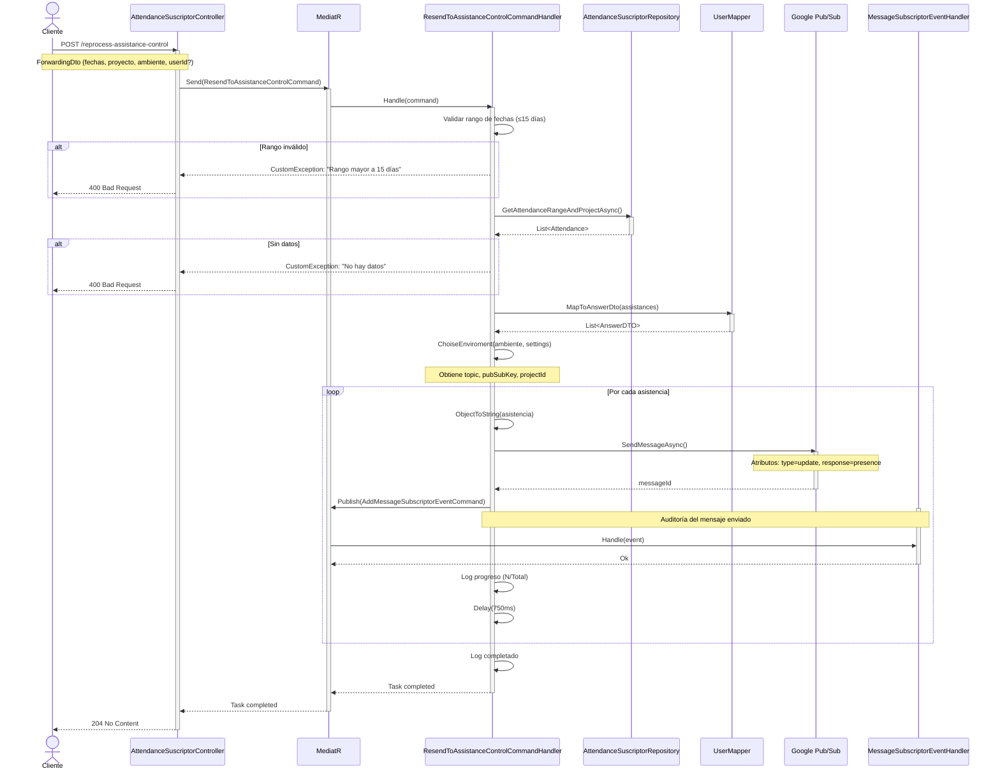

# Endpoint: Reprocess Assistance Control

## Descripción General

Endpoint que permite reprocesar registros de asistencia para enviarlos al sistema de control de asistencias. Recupera asistencias filtradas por rango de fechas, proyecto y opcionalmente usuario, y las reenvía a través de Google Pub/Sub al ambiente configurado.

## Información del Endpoint

- **URL**: `/api/v2/AttendanceSuscriptor/reprocess-assistance-control`
- **Método HTTP**: `POST`
- **Content-Type**: `application/json`
- **Autorización**: No especificada en el código actual

## Request Body

### ForwardingDto

```json
{
  "initialDate": "2025-01-01T00:00:00Z",
  "endDate": "2025-01-15T23:59:59Z",
  "projectId": 123,
  "enviroment": "qa",
  "userId": 456
}
```

### Parámetros

| Campo | Tipo | Requerido | Descripción |
|-------|------|-----------|-------------|
| `initialDate` | DateTime | Sí | Fecha inicial del rango de búsqueda |
| `endDate` | DateTime | Sí | Fecha final del rango de búsqueda |
| `projectId` | int | Sí | ID del proyecto del cual se reprocesarán las asistencias |
| `enviroment` | string | Sí | Ambiente de destino: `development`, `qa`, `staging`, `production` |
| `userId` | int | No | ID del usuario específico (si se omite, se procesan todos los usuarios del proyecto) |

### Validaciones

- **Rango de fechas**: El período entre `initialDate` y `endDate` no debe exceder **15 días**
- **Ambiente válido**: Debe ser uno de los valores del enum: `development`, `qa`, `staging`, `production`
- **Datos existentes**: Debe existir al menos un registro de asistencia en el período seleccionado

## Responses

### 204 No Content (Éxito)
El procesamiento se ha completado exitosamente.

### 400 Bad Request
Errores de validación o reglas de negocio:

```json
{
  "message": "El rango de fechas no debe ser mayor a 15 días"
}
```

```json
{
  "message": "No hay datos por procesar en el periodo seleccionado"
}
```

```json
{
  "message": "El ambiente seleccionado no es valido"
}
```

## Comportamiento del Endpoint

1. **Validación de rango**: Verifica que el rango de fechas no exceda 15 días
2. **Recuperación de datos**: Consulta las asistencias desde el repositorio según los filtros
3. **Validación de existencia**: Verifica que existan datos para procesar
4. **Mapeo de datos**: Convierte las asistencias a DTOs para envío
5. **Selección de ambiente**: Configura el topic, clave y projectId de Pub/Sub según el ambiente
6. **Procesamiento iterativo**: 
   - Envía cada asistencia individualmente a Pub/Sub
   - Registra el mensaje enviado para auditoría
   - Aplica un delay de 750ms entre envíos
   - Registra el progreso en logs

## Atributos del Mensaje Pub/Sub

Cada mensaje enviado incluye los siguientes atributos:

```json
{
  "type": "update",
  "response": "presence"
}
```

## Diagrama de Secuencia



## Ejemplo de Uso

### cURL

```bash
curl -X POST "https://api.example.com/api/v2/AttendanceSuscriptor/reprocess-assistance-control" \
  -H "Content-Type: application/json" \
  -d '{
    "initialDate": "2025-01-01T00:00:00Z",
    "endDate": "2025-01-10T23:59:59Z",
    "projectId": 100,
    "enviroment": "qa",
    "userId": 250
  }'
```

## Consideraciones Importantes

1. **Rendimiento**: El procesamiento incluye un delay de 750ms entre cada mensaje para evitar saturar el sistema de destino
2. **Límite de fechas**: Máximo 15 días de rango para prevenir operaciones muy largas
3. **Procesamiento asíncrono**: Aunque el endpoint responde 204, el procesamiento continúa en segundo plano
4. **Auditoría completa**: Cada mensaje enviado se registra en la base de datos para trazabilidad
5. **Logs detallados**: Se generan logs informativos para monitoreo del proceso

## Arquitectura

Este endpoint sigue el patrón **CQRS** (Command Query Responsibility Segregation) utilizando MediatR:

- **Command**: `ResendToAssistanceControlCommand`
- **Handler**: `ResendToAssistanceControlCommandHandler`
- **Event**: `AddMessageSubscriptorEventCommand` (para auditoría)
